## Clase 15

Empezamos viendo los costos del poco uso que dimos a la BD.

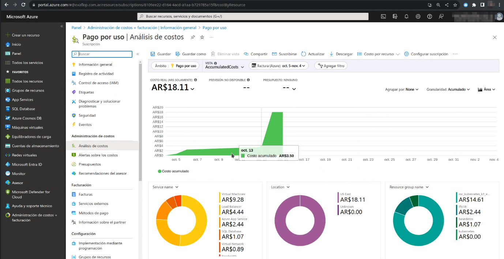

Nos muestra un par de pruebas que hizo en 5 minutos de kubernetes. 

Vemos que se pueden filtrar los reportes y exportar.

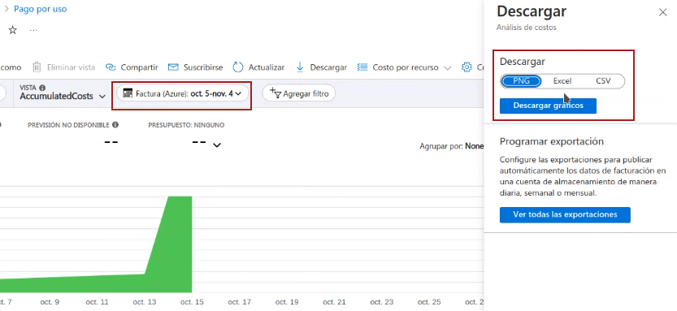

Vamos a las Bases de Datos:

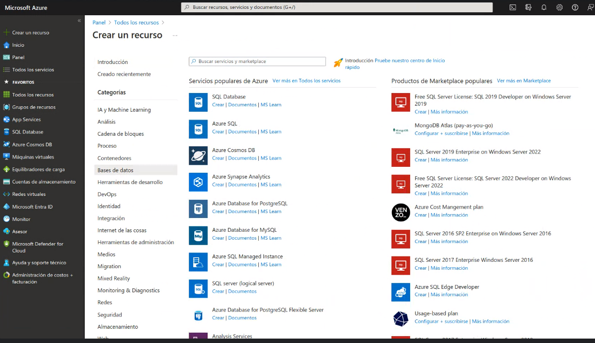

Después volvemos al Learning Path de Azure.

Aspectos básicos de Azure SQL: https://learn.microsoft.com/en-us/training/paths/azure-sql-fundamentals/

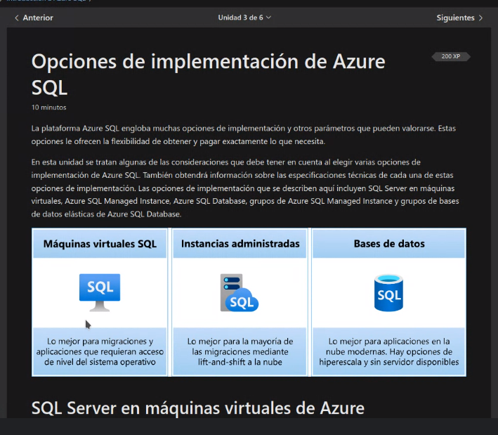

Una opción es Instalar mysql en una VPS.

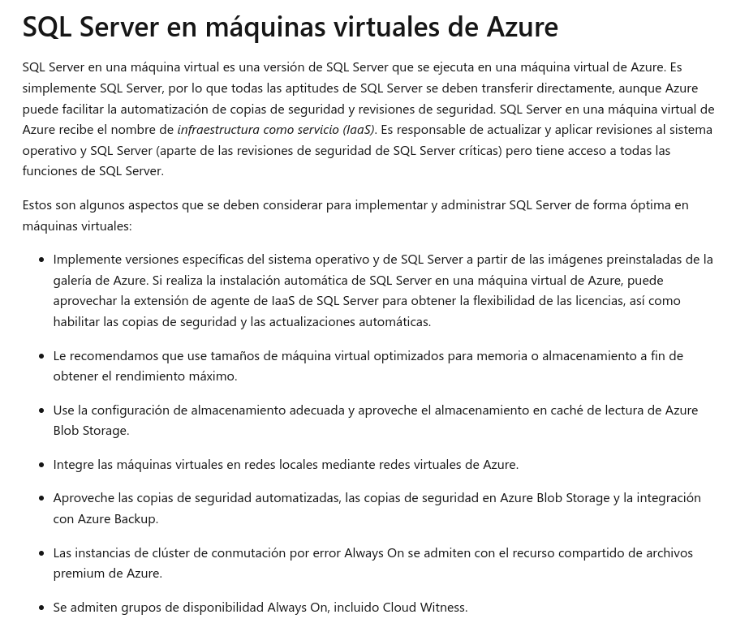

ver completo en https://learn.microsoft.com/es-es/training/modules/azure-sql-intro/3-deployment-options

Nos lo muestra en marketplace de portal:

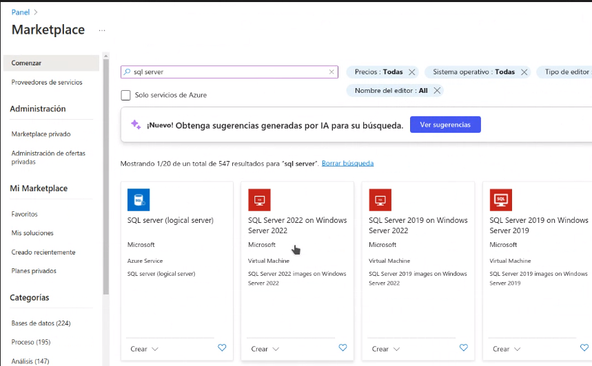

- Imágenes pre-establecidas en el market place.
- Podemos ver el estado del CPU.
- Menciona las licencias del cloud, en el caso de SQL.
- Backups automatizadas

Vemos otros casos de soluciones como SQL Managed Instance:

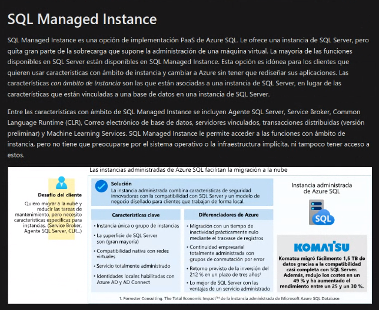

### SQL Database

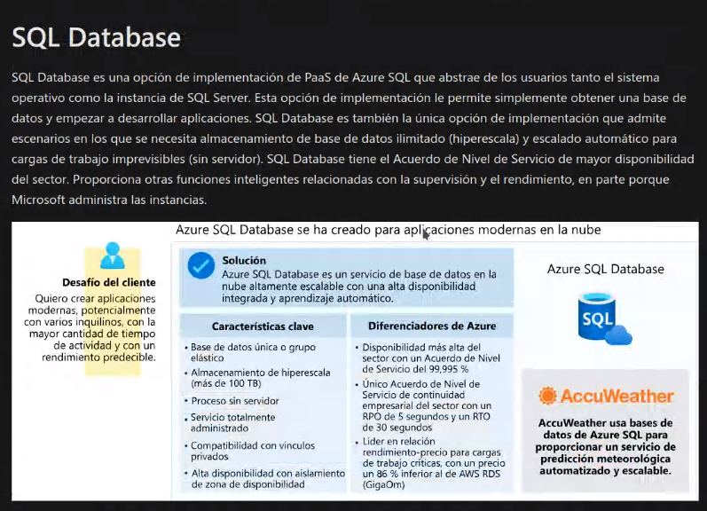

En un nivel de abstracción más arriba.

### Grupo de bases de datos elásticas

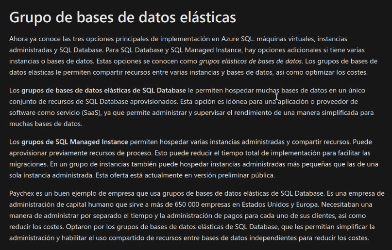

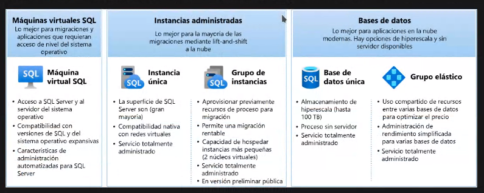

Después pasa a mostrar el modelo de compra y nivel de servicio.

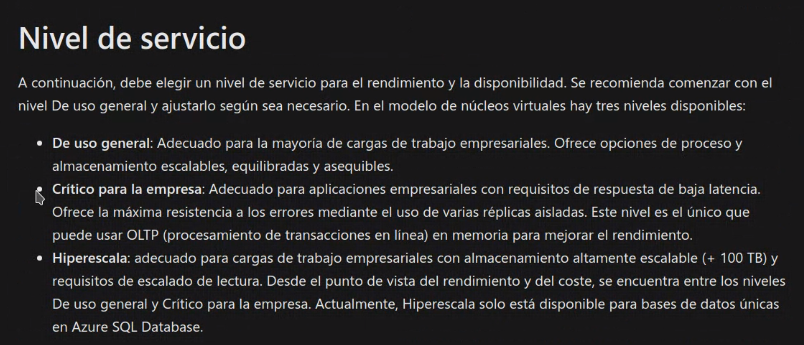

Después de hacer el check de conocimiento, seguimos con otro módulo:

https://learn.microsoft.com/es-es/training/modules/azure-sql-deploy-configure/

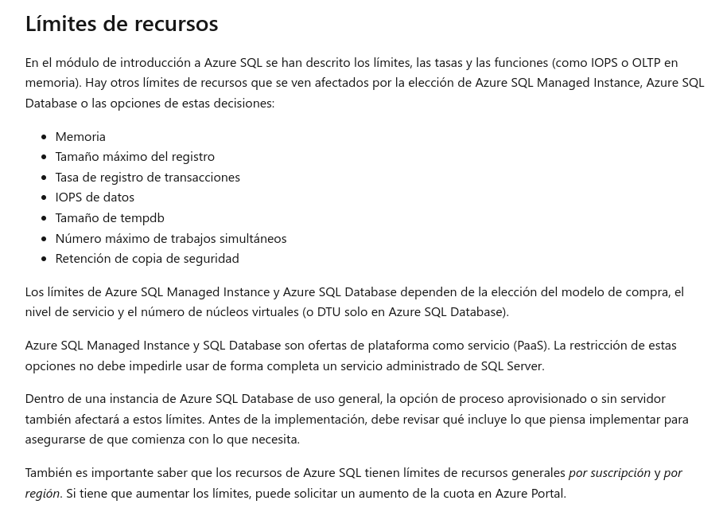

Todo esto en teoría lo vamos a ver mañana. Seguimos viendo lo de BD.