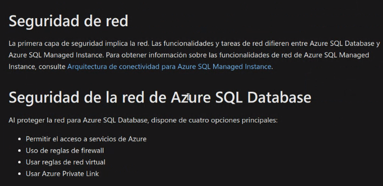
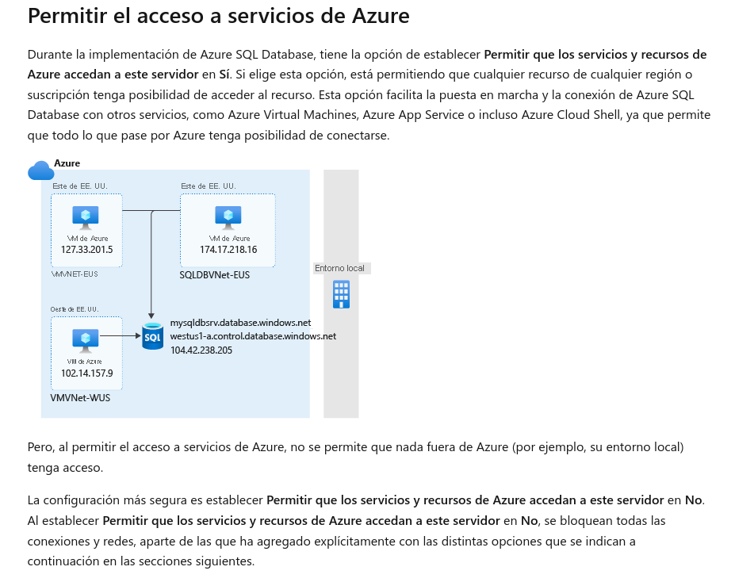
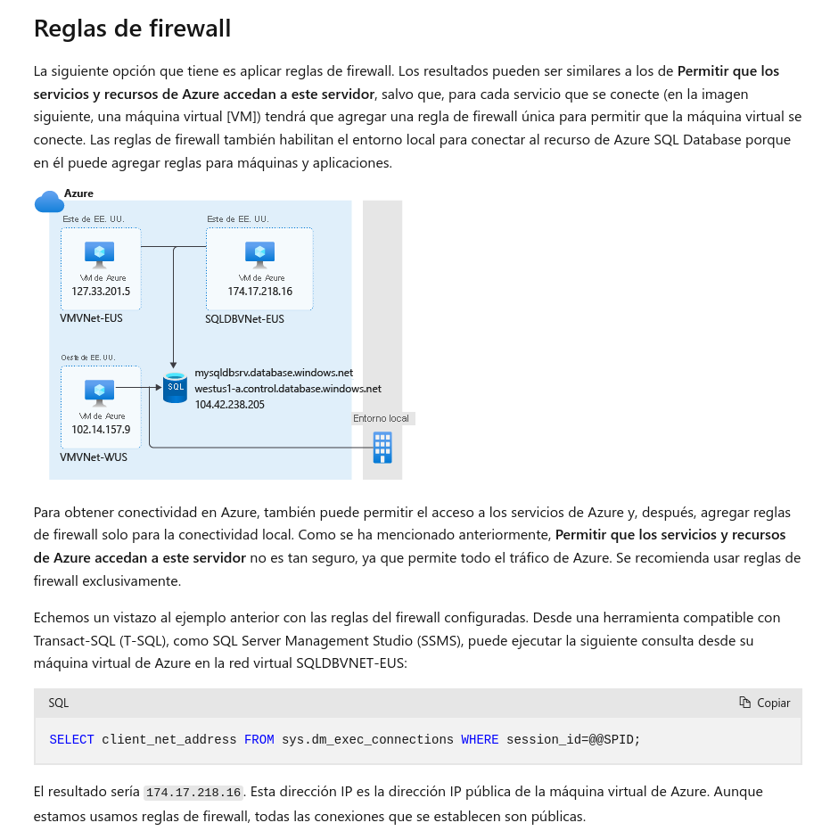
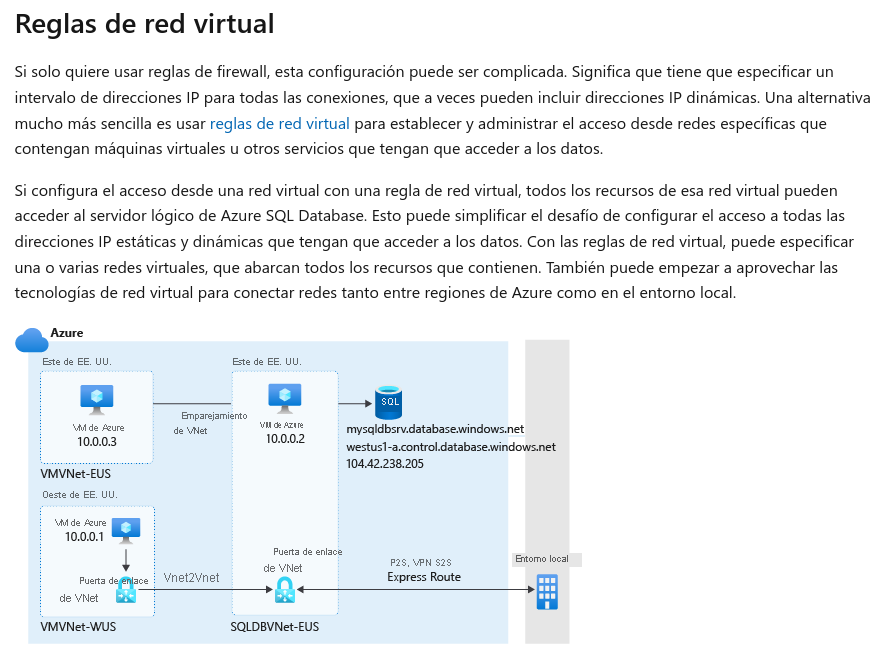
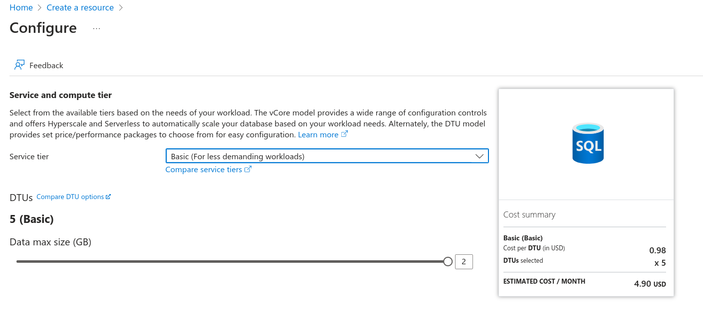
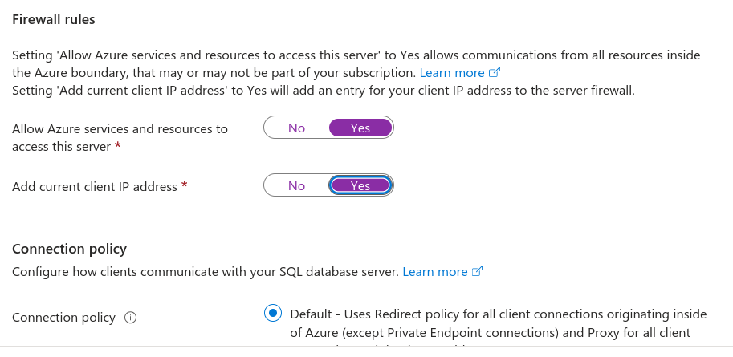
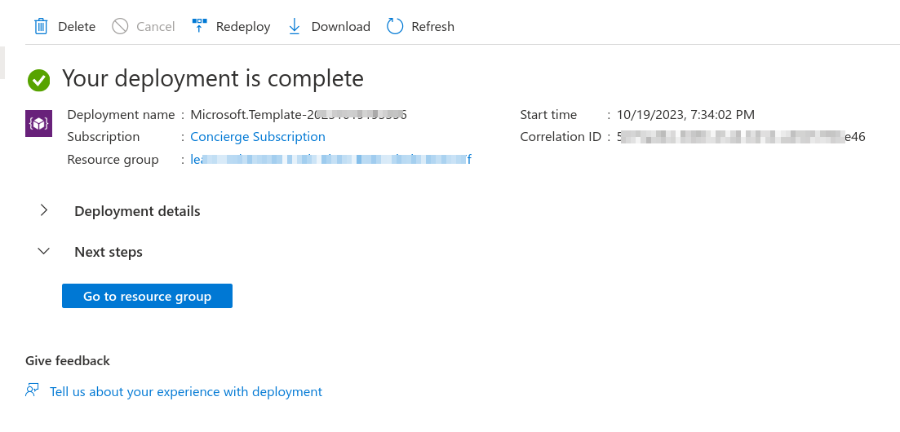
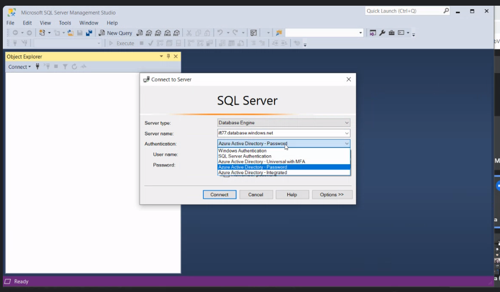

## Clase 16

Clase práctica sobre SQL

Empezamos viendo esta parte de seguridad del Azure Learning Path:

https://learn.microsoft.com/es-es/training/modules/azure-sql-secure-data/2-security-capabilities

Las reglas de red virtual son a nivel LAN. Son los componentes que podemos conectar a nuestra BD.

Todo lo que sea interno de Azure lo voy a manejar con reglas de red virtual.

Para que se conecte hay que habilitar las reglas de Firewall.

### Reglas de red virtual

Virtual network. 

Después de eso pasamos al portal de Azure:

Vamos haciendo la creación de la BD en el espacio aislado:

### Seguridad (security tab)

Después desde windows usa Microsoft SQL Server Managment Studio

hay que configurar el firewall con la IP de nuestra máquina.