## Clase 18

Nos muestra un TP integrador que hay que hacer:

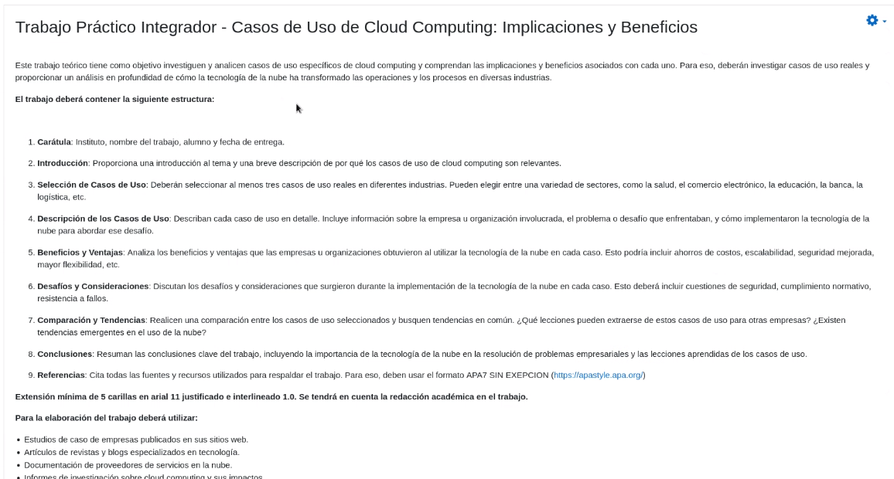

Ver completo en aula virtual

Menciona fechas de parciales (8/11 y 22/11)

---

Después pasamos a ver un tema del AZ path:

https://learn.microsoft.com/es-es/training/modules/intro-to-docker-containers/

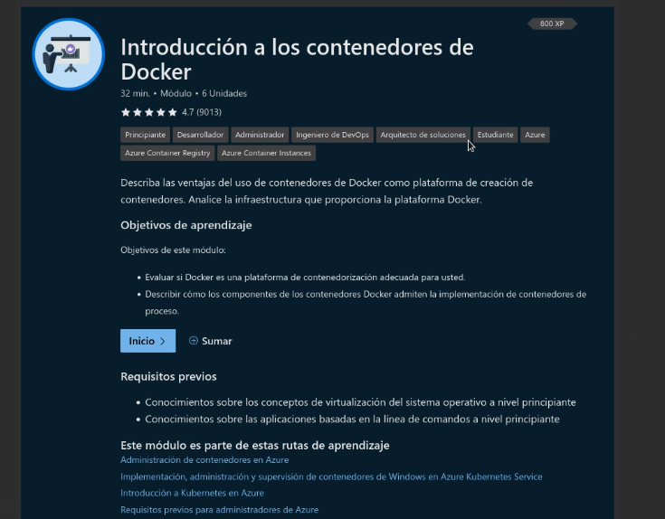

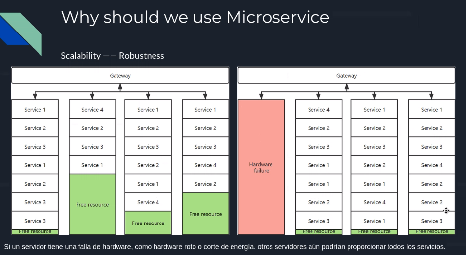

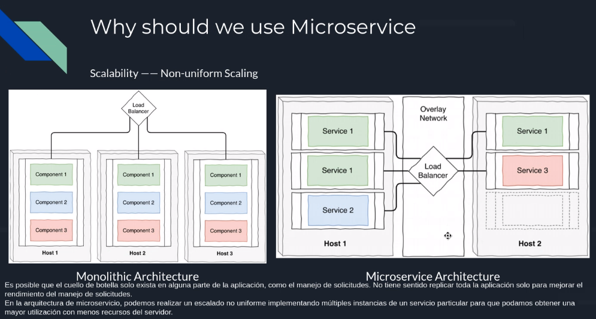

Menciona Openshift de Red Hat:

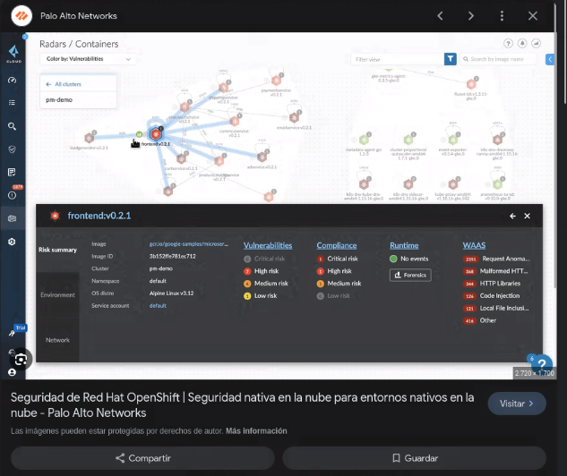

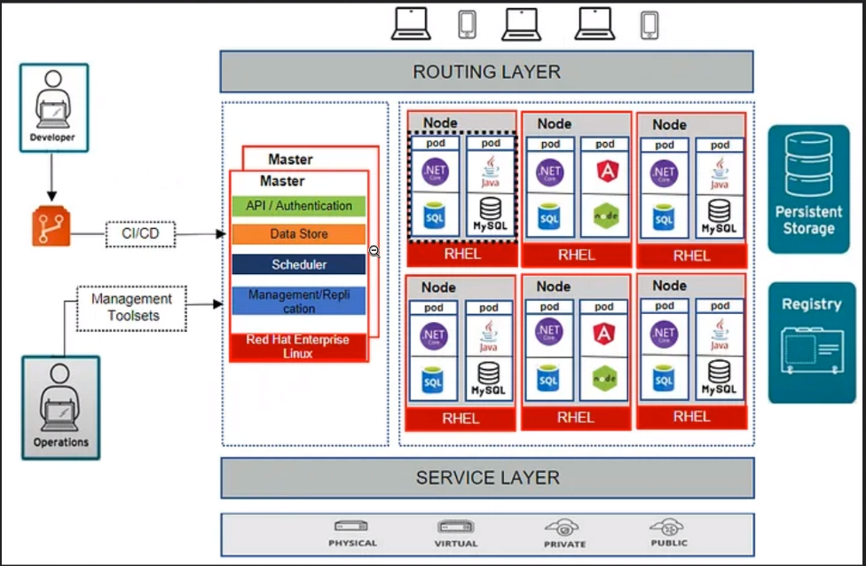

### Contenedores

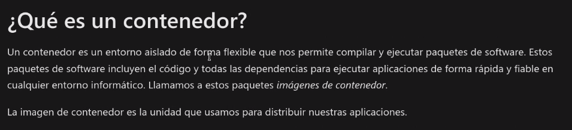

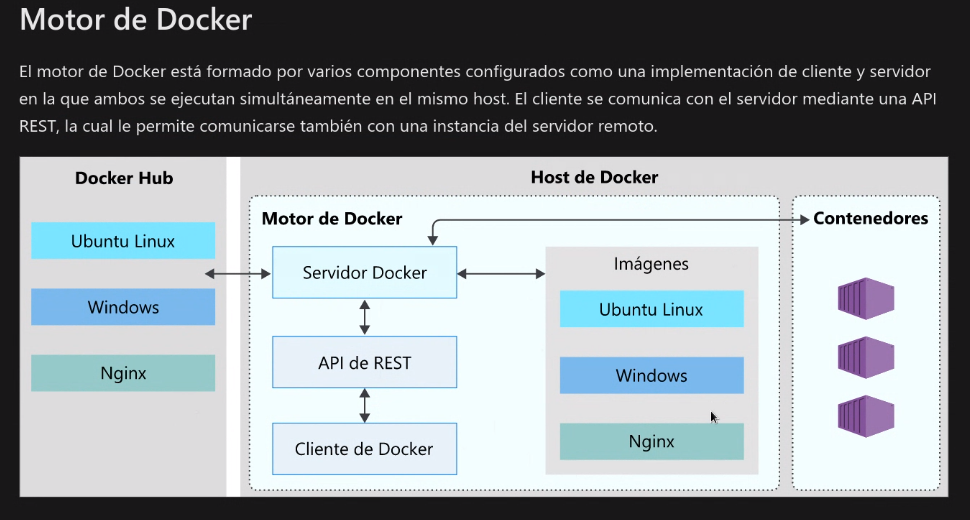

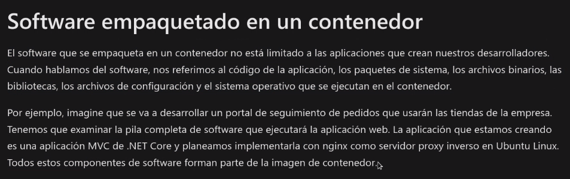

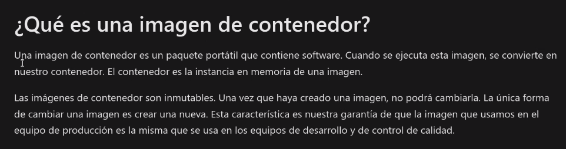

Unionfs

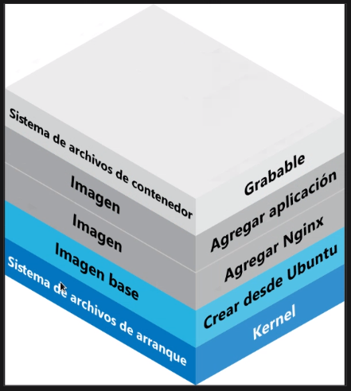

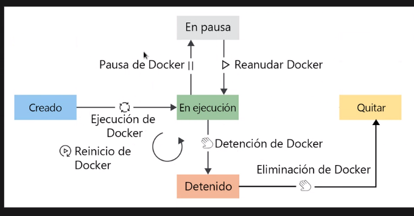

Menciona la persistencia de la data.

Vemos AKS:

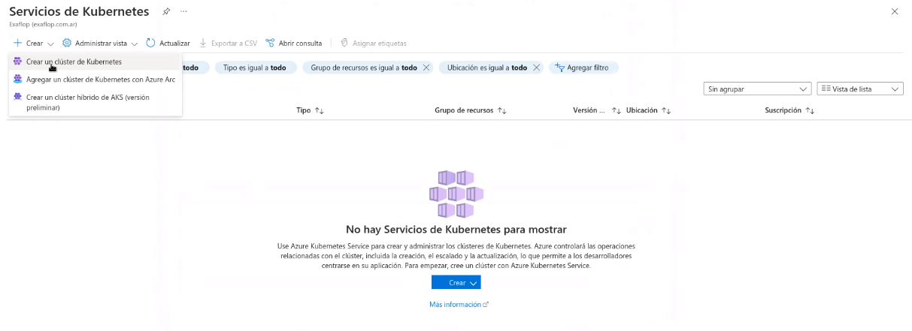

Crea un grupo de recursos. Después hace una integración con una rama de github:

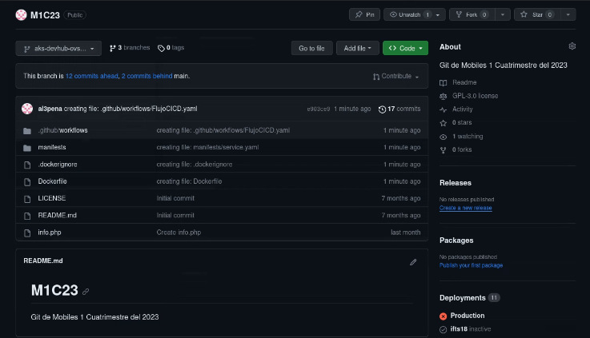

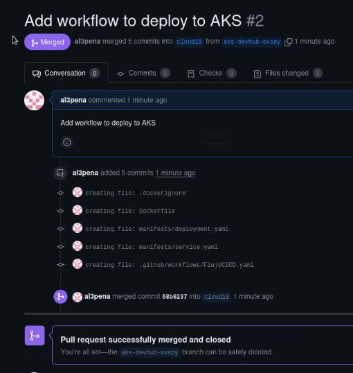

El build tira un par de errores y deja para corregir en otro momento y seguir la clase que viene.

Luego pasa a comentar del parcial:

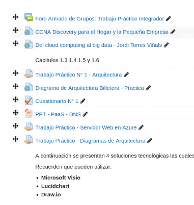

Posibles arquitecturas
Nubes híbridas
Nubes privadas (tener un datacenter solo no es una nube privada)
Preguntas tipo cuestionario
IaaS
VPS
Múltiple Choice similar al del aula virtual
Diagramas de arquitectura, similar al TP

Ejemplos:
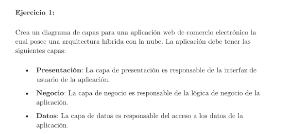

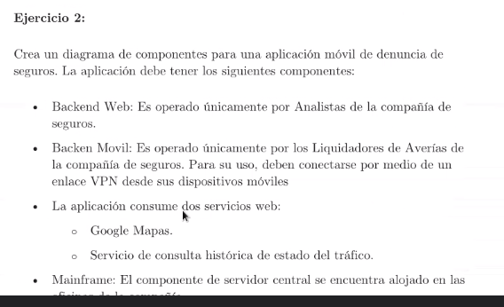

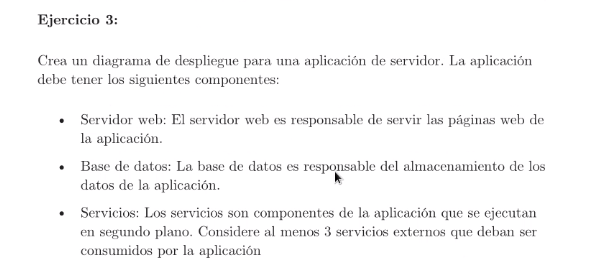

Nos deja otro ejercicio de práctica:

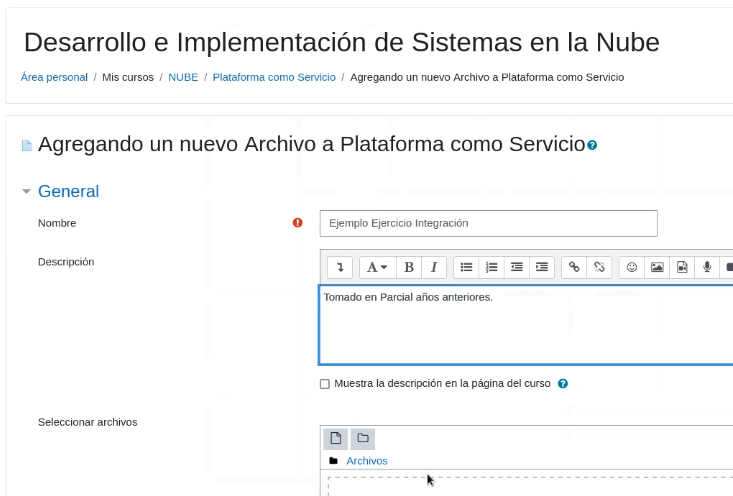

ver en aula virtual

(El parcial se pasa al jueves 9)