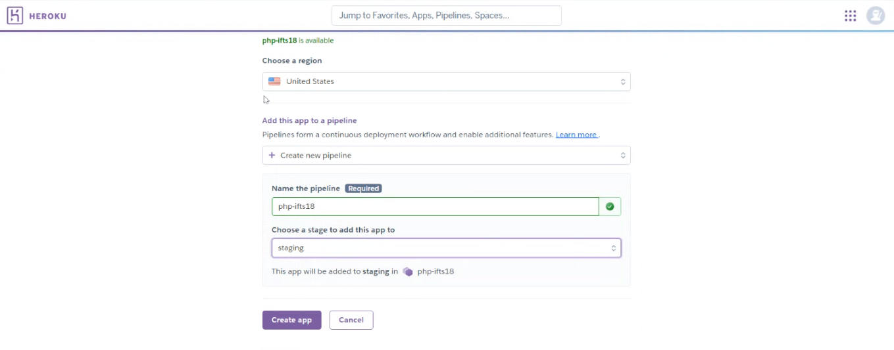
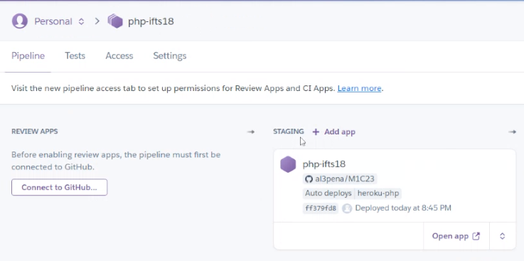
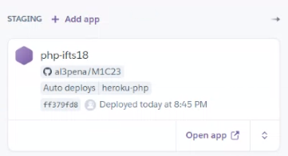
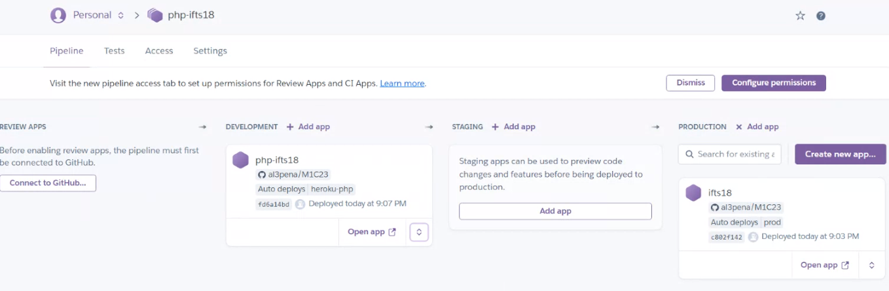
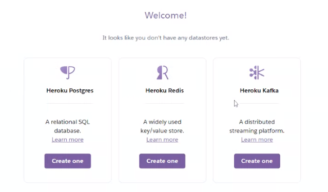

## Clase 19

Empieza a levantar una app con Heroku.

Elige unos parámetros y manda a deploy.

Muestra opción de promover una app de stage a prod. También crea una nueva app que sea de prod.

Muestra el pipeline que arma heroku:

Después arma un esquema de dev, test y prod:

Menciona que se pueden pasar automáticamente entre ramas.

Hace un zapping muuuy breve por algunas vistas como métricas..

