## Clase 20

Cuando me conecto está mostrando cómo integrar una app php con AD vía LDAP:

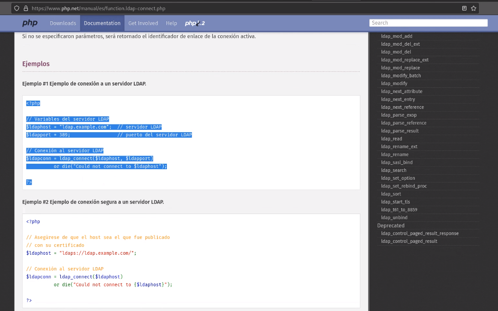

Muestra LDAP con distintos lenguajes:

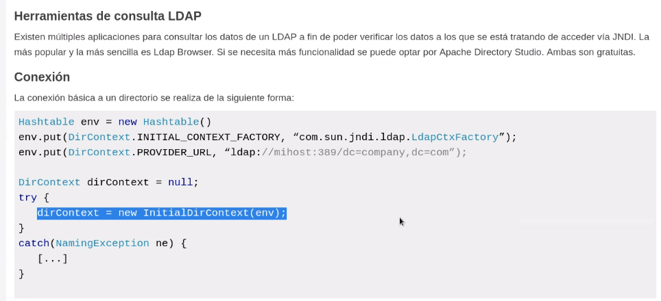

> [Protocolo Ligero de Acceso a Directorios](https://es.wikipedia.org/wiki/Protocolo_Ligero_de_Acceso_a_Directorios)
> 
> LDAP son las siglas de Lightweight Directory Access Protocol que hacen referencia a un protocolo a nivel de aplicación que permite el acceso a un servicio de directorio ordenado y distribuido para buscar diversa información en un entorno de red. LDAP también se considera una base de datos a la que pueden realizarse consultas. [Wikipedia (ES)](https://es.wikipedia.org/wiki/Protocolo_Ligero_de_Acceso_a_Directorios)

Mini diagrama de stack para comunicarse con AD

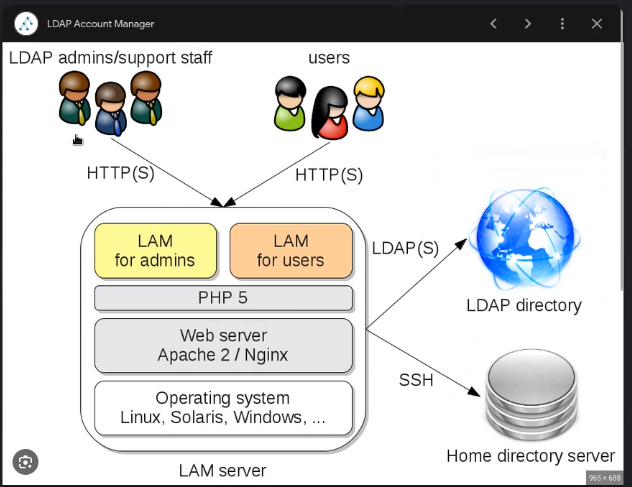

Después pone un ejemplo sobre conectarnos a una impresora con autorización de AD:

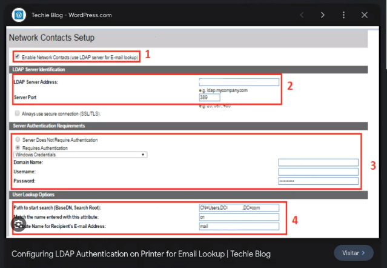

Autenticar la identidad del usuario:

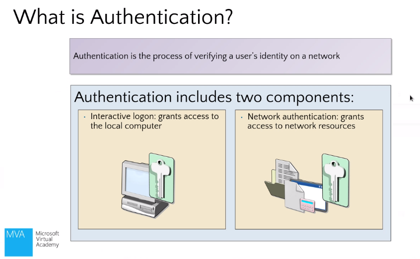

Verificar si el usuario tiene permiso para acceder a ciertas partes del sistema:

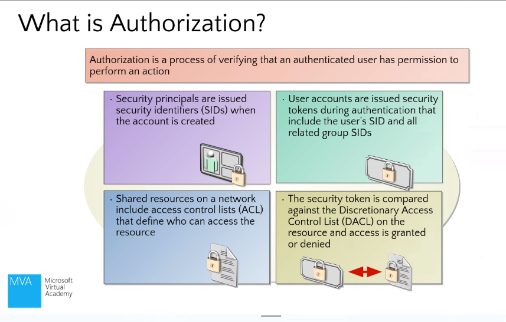

### Requisitos para instalar AD

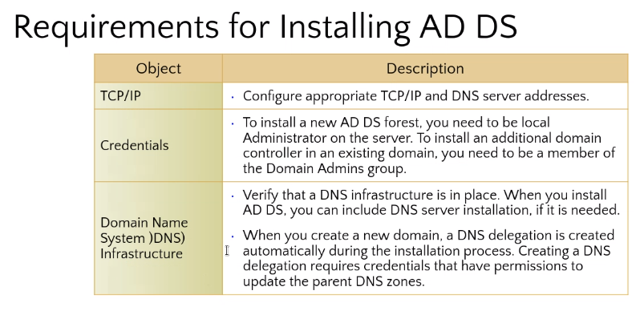

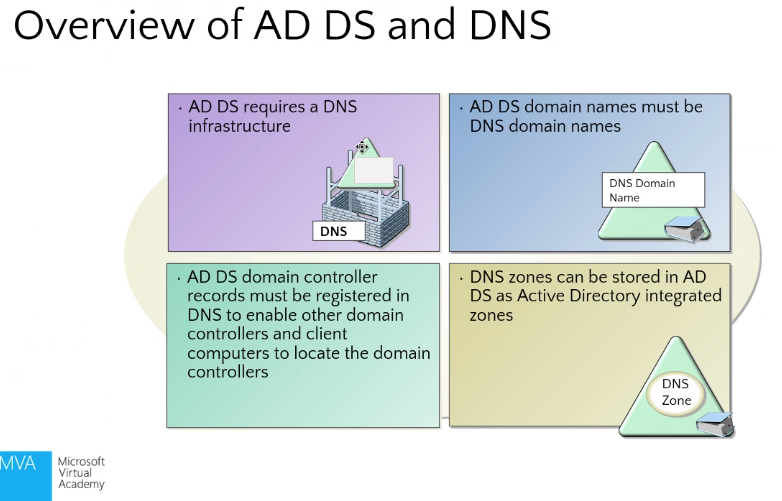

Muestra rápido unos tipos de despliegue de infraestructura para AD. Y luego pasa a mostrar cómo crear una VPS en Azure para instalar AD:

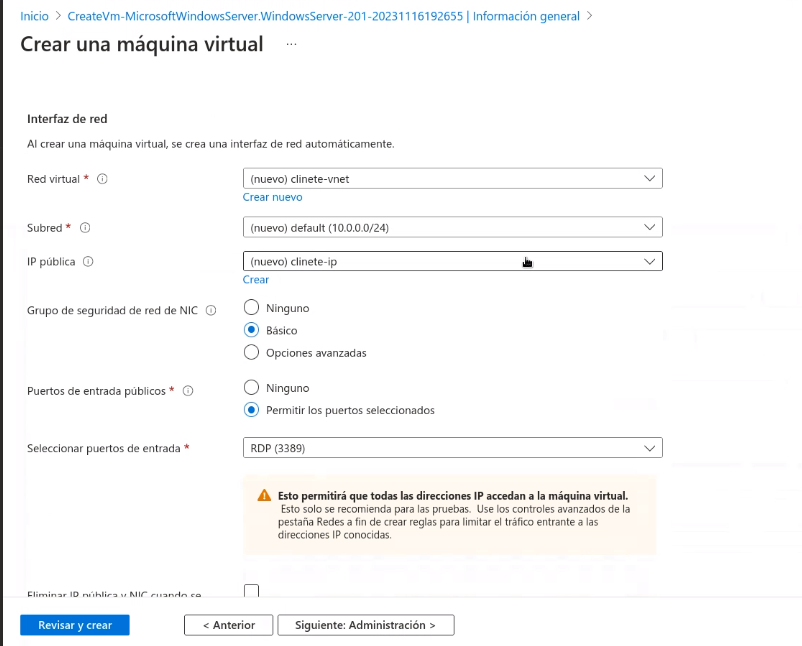

Menciona que usamos Windows Server.

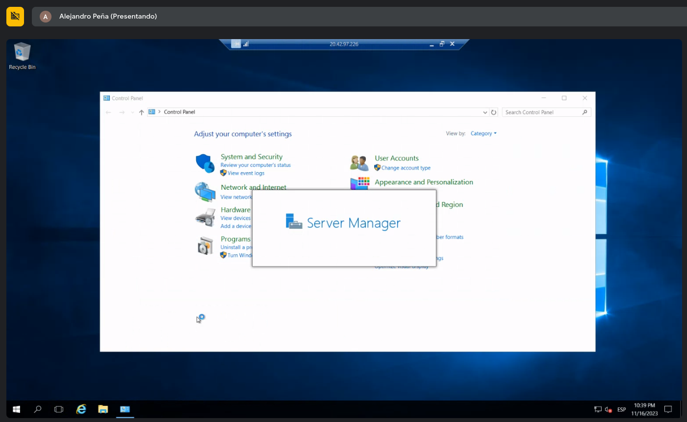

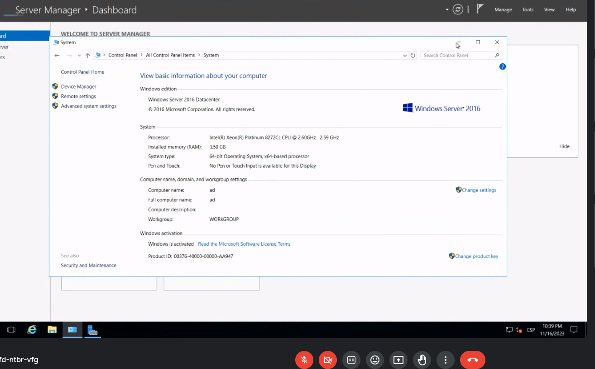

Después hay que conectarse por escritorio remoto al otro server (vps con Windows - Cliente)

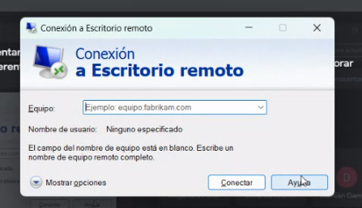

Cliente a la derecha, servidor a la izquierda:

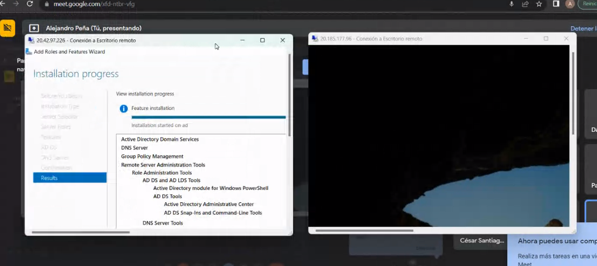

cliente ad desde el portal de azure:

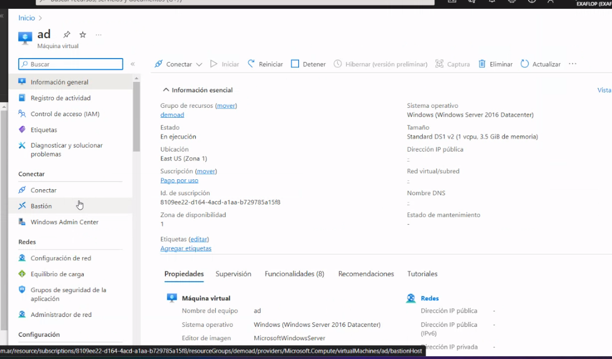

Deployment config del server AD:

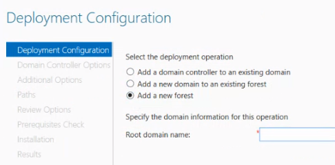

el ejemplo es 'ifts.local'

Seteo de capabilities

---
Después pasa a mostrar temas para el parcial del jueves:

SQL Server
Arquitecturas (microservicios)
DTU (pago por unidades en SQL)
AD (Active Directory)
PPT PaaS-DNS que esta en UNIDAD I y II

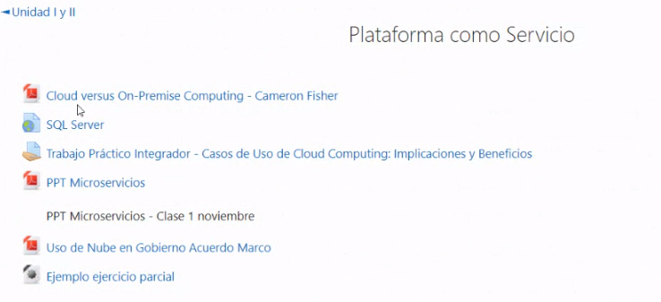

