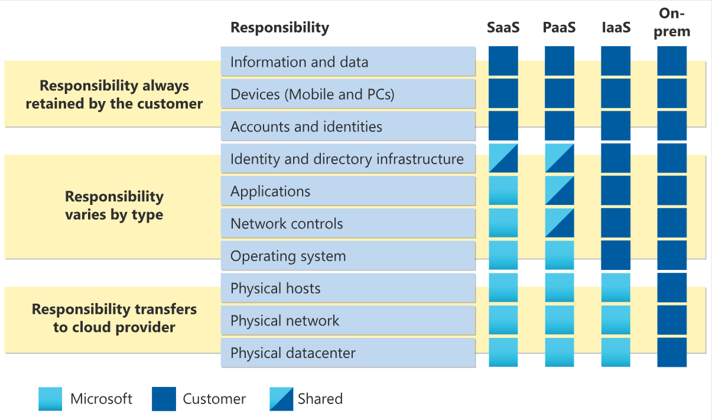
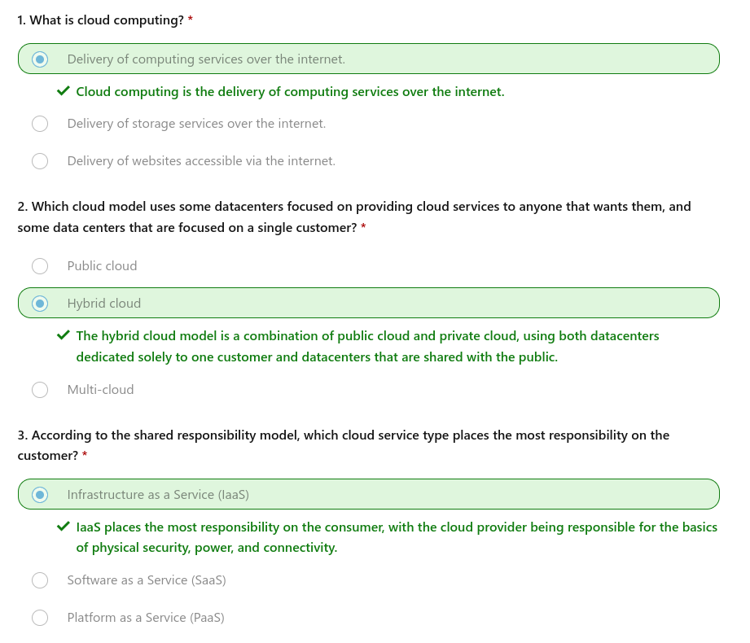

## Describe the shared responsibility model

https://learn.microsoft.com/en-us/training/modules/describe-cloud-compute/3-what-cloud-compute

Start with a traditional corporate datacenter. The company is responsible for maintaining the physical space, ensuring security, and maintaining or replacing the servers if anything happens. The IT department is responsible for maintaining all the infrastructure and software needed to keep the datacenter up and running. They’re also likely to be responsible for keeping all systems patched and on the correct version.

With the shared responsibility model, these responsibilities get shared between the cloud provider and the consumer. Physical security, power, cooling, and network connectivity are the responsibility of the cloud provider. The consumer isn’t collocated with the datacenter, so it wouldn’t make sense for the consumer to have any of those responsibilities.

(...)

You’ll always be responsible for:

- The information and data stored in the cloud
- Devices that are allowed to connect to your cloud (cell phones, computers, and so on)
- The accounts and identities of the people, services, and devices within your organization

The cloud provider is always responsible for:

- The physical datacenter
- The physical network
- The physical hosts

Your service model will determine responsibility for things like:

- Operating systems
- Network controls
- Applications
- Identity and infrastructure

## Define cloud models

What are cloud models? The cloud models define the deployment type of cloud resources. The three main cloud models are: private, public, and hybrid.

|**Public cloud**|**Private cloud**|**Hybrid cloud**|
|---|---|---|
|No capital expenditures to scale up|Organizations have complete control over resources and security|Provides the most flexibility|
|Applications can be quickly provisioned and deprovisioned|Data is not collocated with other organizations’ data|Organizations determine where to run their applications|
|Organizations pay only for what they use|Hardware must be purchased for startup and maintenance|Organizations control security, compliance, or legal requirements|
|Organizations don’t have complete control over resources and security|Organizations are responsible for hardware maintenance and updates|

### Multi-cloud

A fourth, and increasingly likely scenario is a multi-cloud scenario. In a multi-cloud scenario, you use multiple public cloud providers.

## Describe the consumption-based model

With cloud computing, you don’t pay for the physical infrastructure, the electricity, the security, or anything else associated with maintaining a datacenter. Instead, you pay for the IT resources you use. If you don’t use any IT resources this month, you don’t pay for any IT resources.

This consumption-based model has many benefits, including:

- No upfront costs.
- No need to purchase and manage costly infrastructure that users might not use to its fullest potential.
- The ability to pay for more resources when they're needed.
- The ability to stop paying for resources that are no longer needed.

### Compare cloud pricing models

(...) cloud computing is a way to rent compute power and storage from someone else’s datacenter. You can treat cloud resources like you would resources in your own datacenter. However, unlike in your own datacenter, when you're done using cloud resources, you give them back. You’re billed only for what you use.

Instead of maintaining CPUs and storage in your datacenter, you rent them for the time that you need them.

