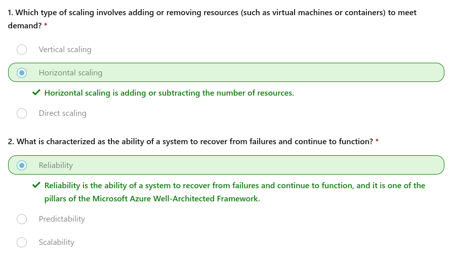

## Describe the benefits of using cloud services

https://learn.microsoft.com/en-us/training/modules/describe-benefits-use-cloud-services/

### High availability

When you’re deploying an application, a service, or any IT resources, it’s important the resources are available when needed. High availability focuses on ensuring maximum availability, regardless of disruptions or events that may occur.

When you’re architecting your solution, you’ll need to account for service availability guarantees. Azure is a highly available cloud environment with uptime guarantees depending on the service. These guarantees are part of the service-level agreements (SLAs).

### Vertical scaling

With vertical scaling, if you were developing an app and you needed more processing power, you could vertically scale up to add more CPUs or RAM to the virtual machine. Conversely, if you realized you had over-specified the needs, you could vertically scale down by lowering the CPU or RAM specifications.

### Horizontal scaling

With horizontal scaling, if you suddenly experienced a steep jump in demand, your deployed resources could be scaled out (either automatically or manually). For example, you could add additional virtual machines or containers, scaling out. In the same manner, if there was a significant drop in demand, deployed resources could be scaled in (either automatically or manually), scaling in.

### Reliability

The cloud, by virtue of its decentralized design, naturally supports a reliable and resilient infrastructure. With a decentralized design, the cloud enables you to have resources deployed in regions around the world. With this global scale, even if one region has a catastrophic event other regions are still up and running.

### Predictability

Predictability in the cloud lets you move forward with confidence. Predictability can be focused on performance predictability or cost predictability.

### Performance

Performance predictability focuses on predicting the resources needed to deliver a positive experience for your customers. Autoscaling, load balancing, and high availability are just some of the cloud concepts that support performance predictability.

### Cost

Cost predictability is focused on predicting or forecasting the cost of the cloud spend. With the cloud, you can track your resource use in real time, monitor resources to ensure that you’re using them in the most efficient way, and apply data analytics to find patterns and trends that help better plan resource deployments.

---
## Describe the benefits of security and governance in the cloud

Whether you’re deploying infrastructure as a service or software as a service, cloud features support governance and compliance. Things like set templates help ensure that all your deployed resources meet corporate standards and government regulatory requirements.

On the security side, you can find a cloud solution that matches your security needs. If you want maximum control of security, infrastructure as a service provides you with physical resources but lets you manage the operating systems and installed software, including patches and maintenance. If you want patches and maintenance taken care of automatically, platform as a service or software as a service deployments may be the best cloud strategies for you.

By establishing a good governance footprint early, you can keep your cloud footprint updated, secure, and well managed.

---
## Describe the benefits of manageability in the cloud

A major benefit of cloud computing is the manageability options.

### Management of the cloud

Management of the cloud speaks to managing your cloud resources. In the cloud, you can:

- Automatically scale resource deployment based on need.
- Deploy resources based on a preconfigured template, removing the need for manual configuration.
- Monitor the health of resources and automatically replace failing resources.
- Receive automatic alerts based on configured metrics, so you’re aware of performance in real time.

### Management in the cloud

Management in the cloud speaks to how you’re able to manage your cloud environment and resources. You can manage these:

- Through a web portal.
- Using a command line interface.
- Using APIs.
- Using PowerShell.

## Knowledge check

