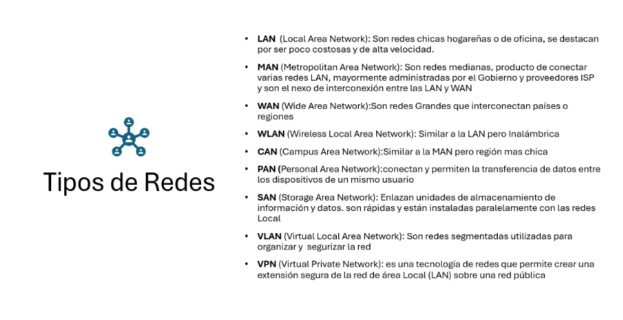

## Clase 02

Dejamos armados los grupos y enviado al profe.

Parcial martes 08 de Octubre.

Componentes

El objetivo es compartir recursos

### Topología de resdes

### Tipos de Redes

Ejemplo:

### Sistemas Operativos de Red (NOS)

Cualquier SO que se usa para redes.

### Dispositivos

Menciona uno por uno los dispositivos:

- Hub
- Switch
- Router
- Bridge

Sobre protocolo menciona por encima los principales.
