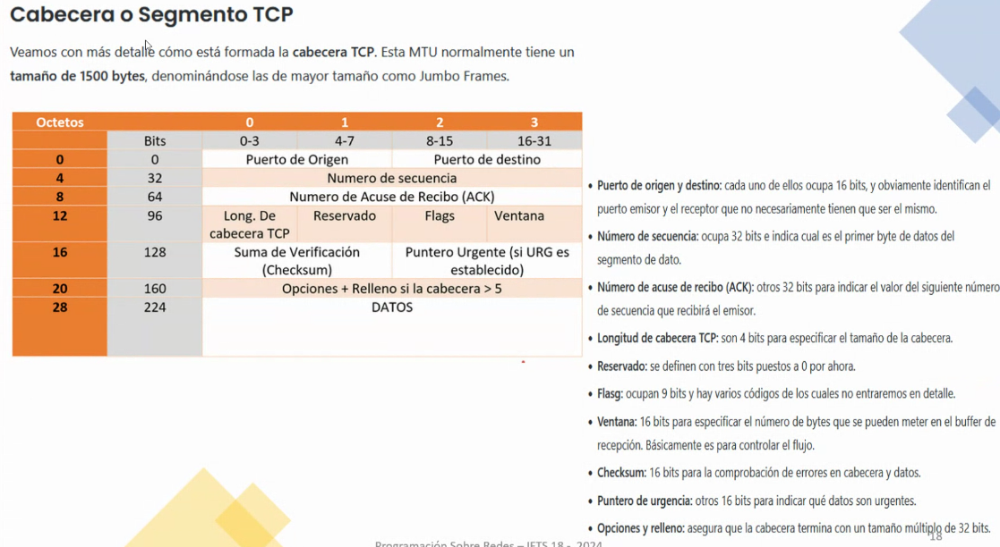

## Clase 03

Empieza comentando la entrega del TP (viernes 20/09). Si el TP es sobresaliente, no nos va a tomar parcial de ese tema, para eso hay que hacer algo original por ejemplo un video, una presentación creativa.

1/10/2024 Repaso antes del parcial teórico. El práctico va a ser parecido.

Empieza con un juego tipo trivia con repaso de la clase anterior.

Volvemos a retomar conceptos de protocolos de red:

### UDP vs TCP

### Capas

Ejemplos de capas, por lo general los swithces trabajan de esta forma

Capa 3, de transporte:

Otro diagrama que ejemplifica las diferencias entre modelo OSI y TCP

Descripción ampliada:

Cómo se segmenta el protocolo:

Terminamos hablando de DNS en general desde el lado del desarrollador.

Comenta que para la próxima clase vemos Packet Tracer.