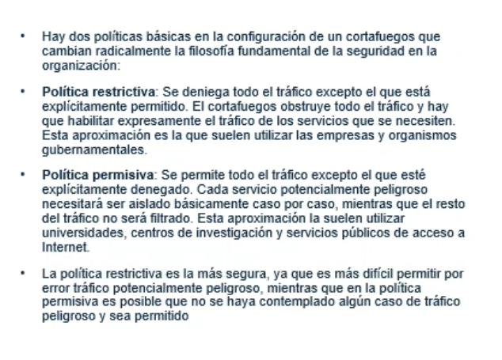

## Clase 04

(llego un poco tarde, ya está avanzada la clase)

### DHCO

El Protocolo de configuración dinámica de host (DHCP) es un protocolo cliente-servidor que proporciona automáticamente un host de protocolo de Internet (IP) con su dirección IP y otra información de configuración relacionada, como la máscara de subred y la puerta de enlace de predeterminada.

Asigna una IP dinámica.

Tipos de DHCP

- Estático
- Dinámico
- De relevo

Menciona otros temas, muy por encima, con algunos ejemplos básicos:

- Firewall
- DMZ

No hay mucha explicación, habría que buscar en otras fuentas, pero anoto los temas porque pueden entrar en el parcial.

Políticas de un Firewall

Gateway:

Ejemplo: API Gateway. 

Funcionamiento de un Gateway:

Aplicaciones y ejemplos:

Proxy:

Dirección IP

IPv4 y máscara subred

Después hacemos unas pruebas con packet tracer que comparten en clase:

Voy haciendo seguimiento en mi compu:

TBD: usar el switch genérico