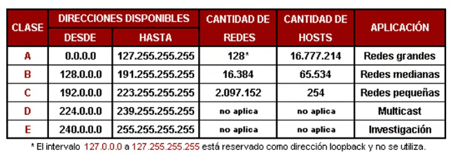
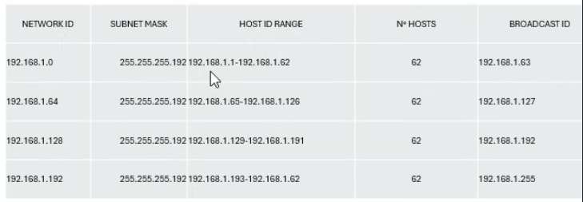
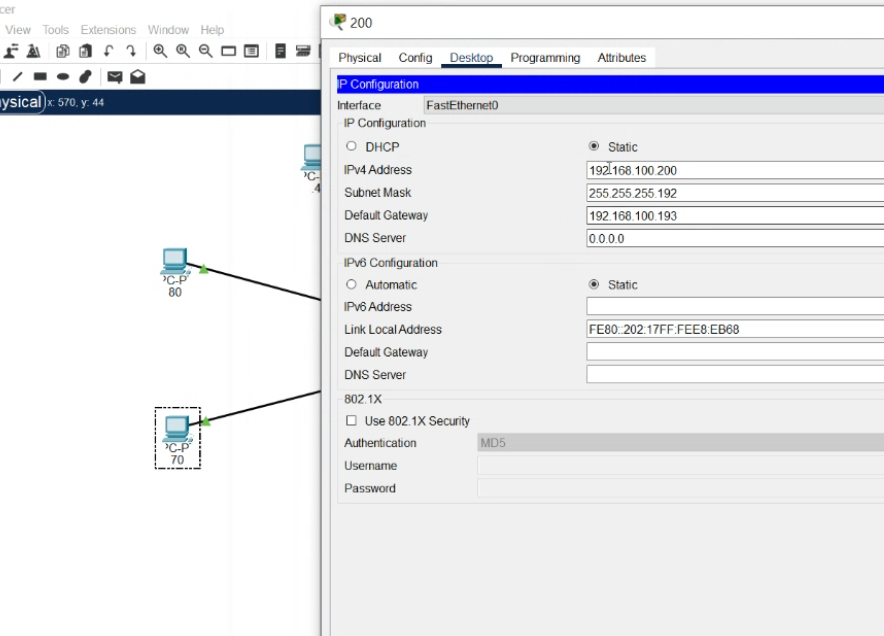

## Clase 05

Seguimos viendo contenido de los pdf que están en drive. 

TBD: completar la lista de temas.

- Modelo OSI
    - Capas del modelo
- Cabeceras
- Subnetting
- Clases de redes

Ejemplo de ejercicio:

Indicar cuál es la máscara subred

Comparte pantalla un compañero y avanzamos con packet tracer:

