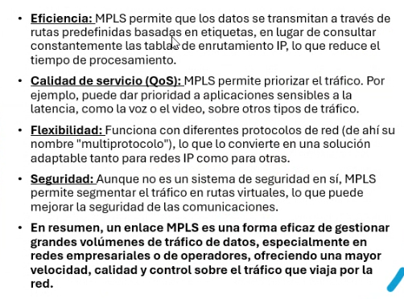

## Clase 06

Comenta tema parcial, subir a github y mandar por mail.

Vamos a tema Subneteo:

MPLS

Características de MPLS

Ejercicio

Necesitamos Subnetear una red 172.168.1.0, para crear 2 subredes de hasta 80 computadoras c/u

Resolvemos el ejercicio de ejemplo:

Así tiene que ser la tabla de entrega

Mi ejercicio resuelto:

Después pasamos a un ejercicio de packet tracer para configurar un servidor DHCP y un DNS:

