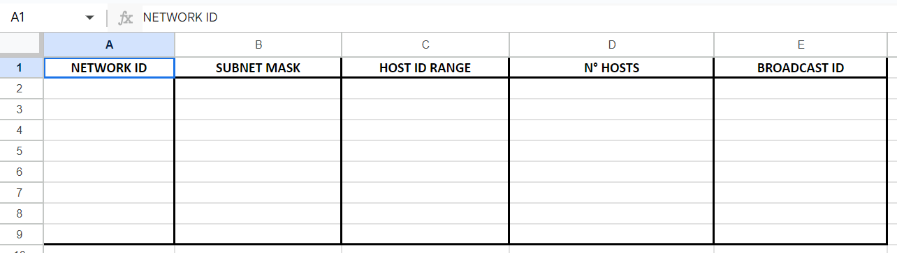
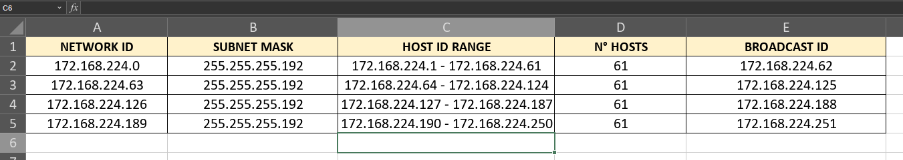
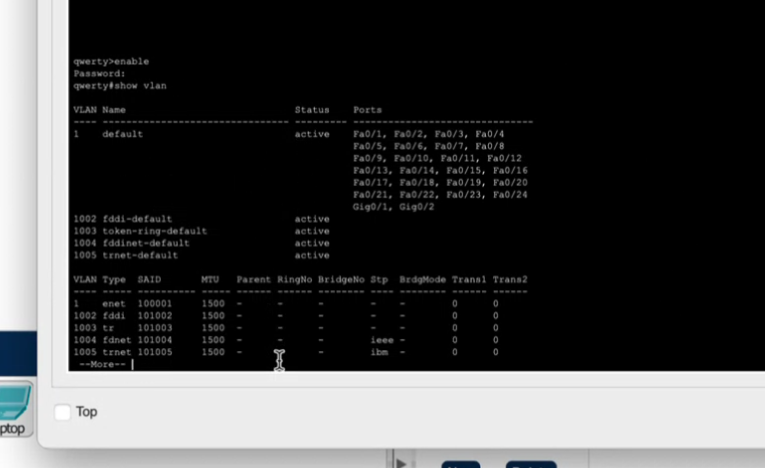
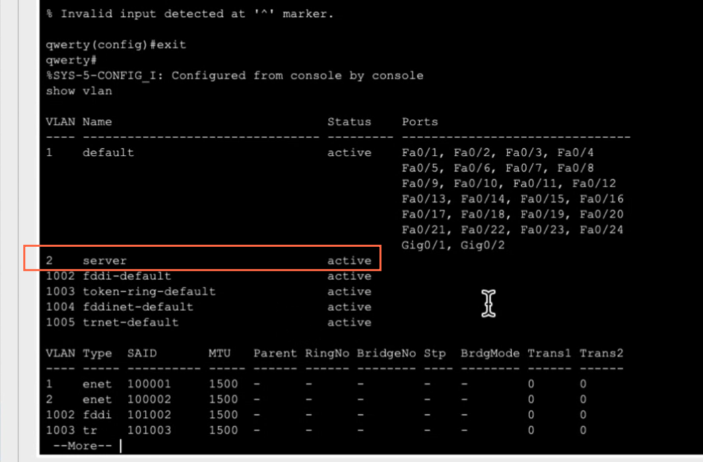
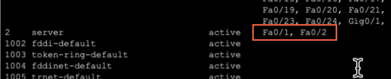

## Clase 07

Emepzamos viendo un ejercicio nuevo de subneteo:

Necesitamos Subnetear una red 172.168.224.0, para crear 4 subredes de hasta 61 computadoras c/u.

resuelvo el ejercicio local:

(a chequear si está ok, mi compañero que compartió tenía otros números en el broadcast ip que tengo que revisar)

---

Seguimos con Packet Tracer.

Un compañero comparte, vamos armando una red con 6 PC, dos server (uno DHCP y otro DNS). Después crean unas vlan:

Creamos la vlan

Se asignan puertos 1 y 2:

Luego creamos otras vlan y asignamos puertos.

Termina el ejercicio Packet Tracer.

----

Comenta tema parciales práctico y teórico (este no tenemos que con mi grupo por haber hecho el TP de Proxy SOCKS)

Después voy a buscar más info sobre el parcíal práctico (que debería ser con Packet Tracer)