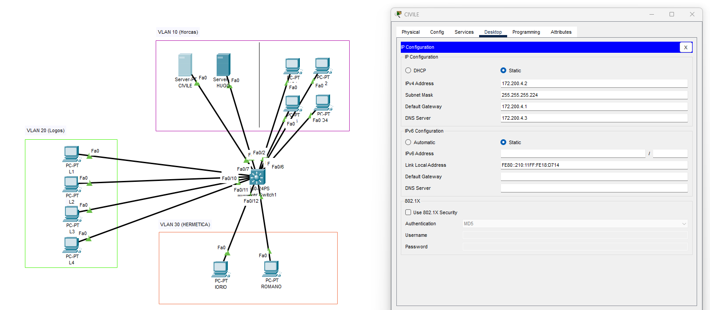

## Parcial práctico

Nos da la consigna:

se pide crear 4 vlans a partir del subneteo de la red 172.200.4.0 cada red tiene q tener como maximo 32 host diponibles

Instalación del Switch: Instalar un Switch 3560 con el nombre metal y configurarle la contraseña "metalargento"

**conf de vlans**

1. vlan debe ser llamada "Horcas" con 4 puertos asignados y conectado 2 servidores y de dhcp con mobre de "CIVILE" y el otro de DNS con nombre "HUGO".
2. vlan debe llamarse "Horcas" que contenga 4 computadoras las cuales tienen q obtener ip dinamicamente nombre HO1, HO2, HO3 y HO4 respectivamente
3. vlan debe llamarse "Logos" que contenga 4 computadoras las cuales tienen q obtener ip dinamicamente nombres de los equipos L1, L2, L3 y L4 respectivamente
4. vlan debe llamarse "HERMETICA" que contengan dos conputadoras la cual una de ella se debe llamar "IORIO" con ip fija y debe conectarse al switch por telnet. La otra restante debe tener ip dinamica y se llama "ROMANO"

De todas las computadoras y servers se deberian poder hacer ping por nombre o ip a todos los host de la red y tener respuesta satisfactoria

---

Resultado final:

Nos hace algunas preguntas y seguimiento de la configuración.

---

Nos comenta que promocionamos pero no nos da la nota, la vamos a saber al final de la cursada.