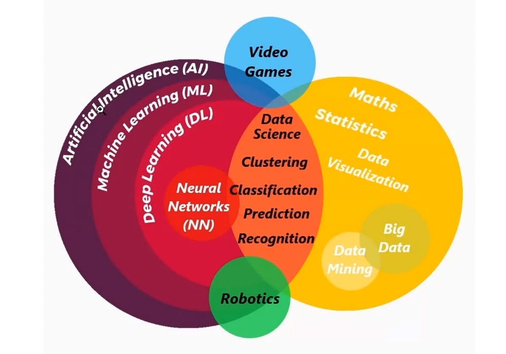

## Clase 01

Empieza comentando modalidad de la materia.

Vamos a ver IA a nivel teórico, con algo de práctica.

Menciona los temas de la materia (TBD: luego lo cargo completo).

---

Empezamos con una conversación sobre lo que pensamos de las IA. Vemos algunas diferencias entre ML, Deep learning, Data science, etc.

Nos muestra un diagrama donde se relacionan los conceptos:

Generación de conocimiento que sirva a algún fin. Para que la máquina "aprenda" y pueda resolver problemas.

En mi caso menciono la diferencia entre Inteligencia Artificial e "inteligencia creada por el hombre", en base a la interpretación de Machine Decisition Not Final: https://www.chaosmotics.com/en/variations/machine-decision-is-not-final-i

Seguimos debatiendo sobre ML, IA de reconocimiento facial, usos actuales de las técnicas que se vienen desarrollando desde los 50s.

Menciona la máquina de Turing: https://es.wikipedia.org/wiki/M%C3%A1quina_de_Turing

Terminamos la clase mencionando que en la próxima vamos a ver de qué forma se genera este "aprendizaje" en la computación.