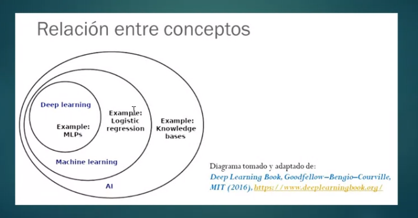
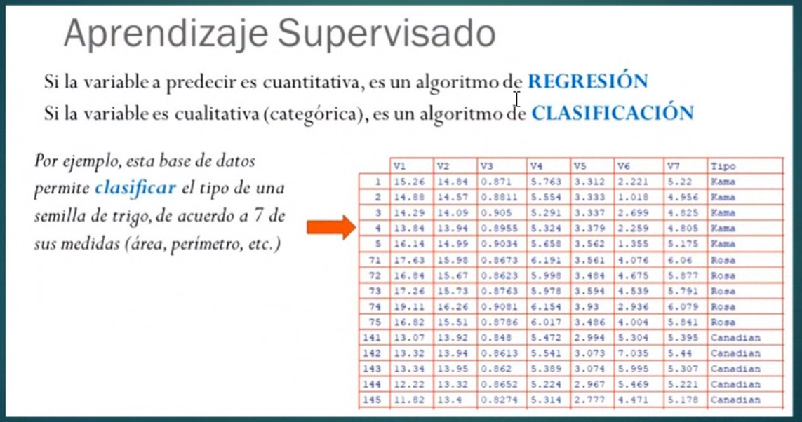

## Clase 03

Para esta clase nos había pedido que tengamos instalado lo siguiente:

- python
- TensorFlow
- Nunpy

Omite esto...

Pasa hablar de Redes neuronales

Vuelve a retomar sobre IA, Machine Learning..

- Machine Learning
- Deep Learning

Diagrama que incluye estos conceptos:

Paradigmas:

- Supervisado
- No-supervisado
- Semi-supervisado

Regresión (numérico) y clasificación (clases)

Sigue mostrando algunas pantallas de redes neuronales:

A nivel conceptual cómo funcionarían las redes inspiradas en red neuronal biológica.

Muestra ejemplo de perceptrón simple: OR

Limitaciones de perceptrón simple

