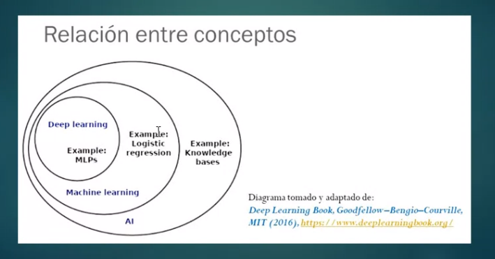
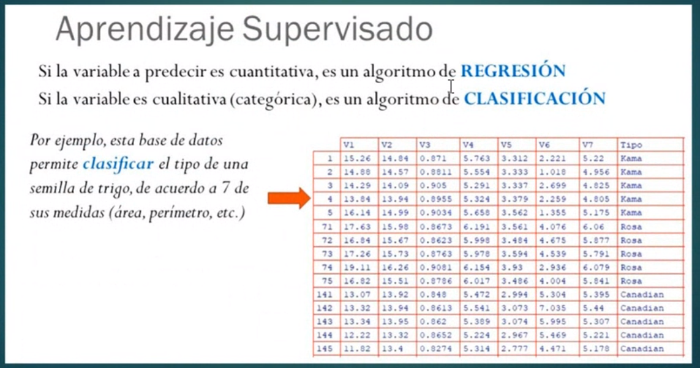
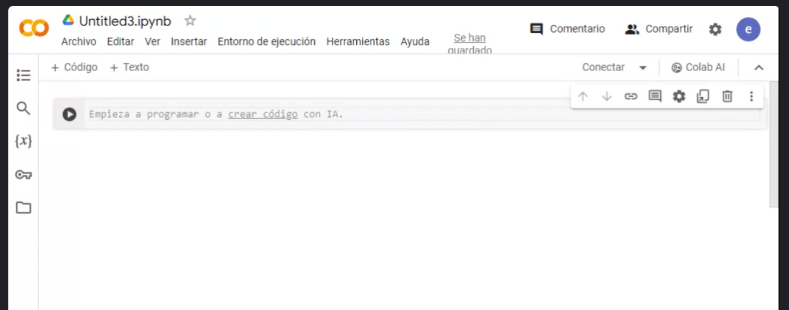
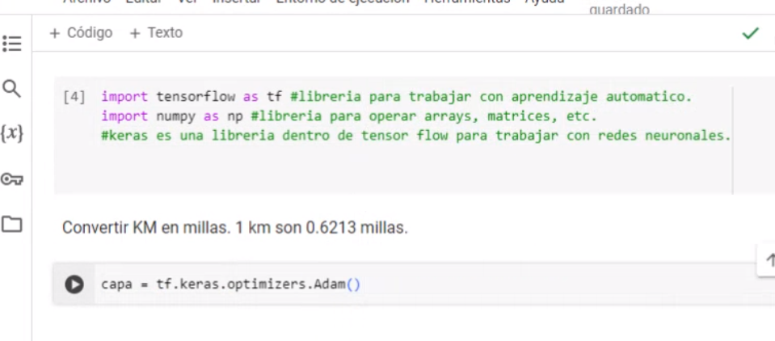

## Clase 04

Nos comenta que vamos a repasar teoría y vamos a hacer una pruena con google colab.

Arranca el repaso.

Muestra las diapos de clase anterior.

La red que vamos a hacer va a estar dentro de Machine Learning en este diagrama:

Comenta la matriz de aprendizaje supervisado que habíamos visto antes:

Después de mostrar algo de regresión lineal, pasa a hacer la primera red en colab:

Avanzamos con el modelo en clase, quedó bueno el ejercicio. Dejo mi versión en un archivo jupiter notebook exportado de colab.

