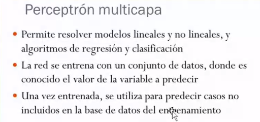
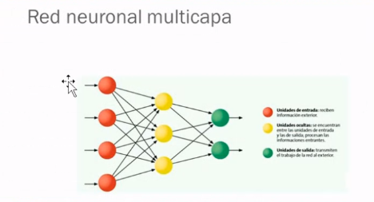
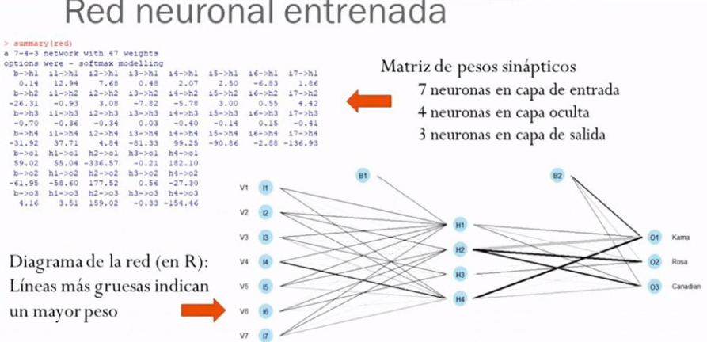
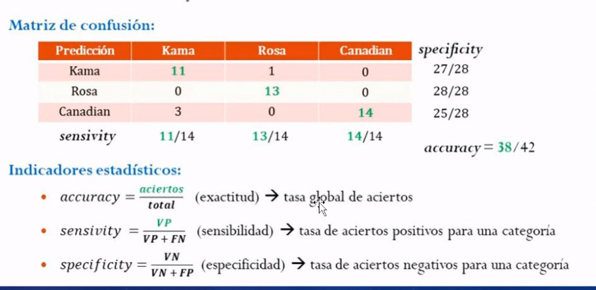
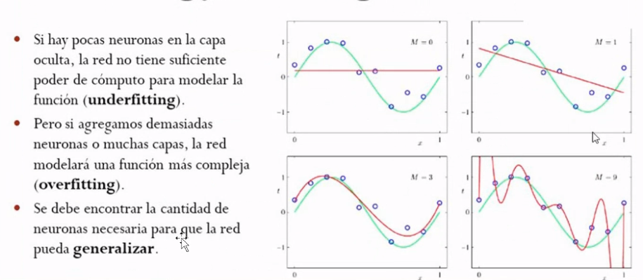
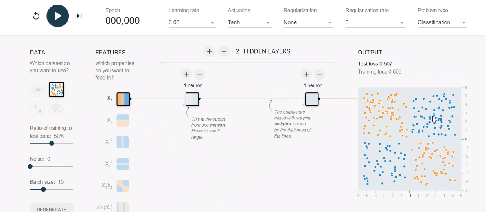

## Clase 05
Comenta que el ejercicio pasado fue de regresión lineal (perceptrón simple)

### Perceptrón Multicapa
Resuelve problemas más complicados. No son lineales, no se pueden calcular con un algoritmo fácilmente.

Vamos a trabajar con algoritmos de regresión y calificación.

Las neuronas de entrada y de salida están todas conectadas.

Varibale dependiente e independiente.

Pesos sinápticos

> El concepto de "pesos sinápticos" se refiere a la fuerza o eficacia de las conexiones entre las neuronas en una red neuronal. En el contexto de la neurociencia y el aprendizaje automático, las neuronas se comunican entre sí a través de sinapsis, que son las conexiones entre ellas. Estas sinapsis tienen un peso asociado que determina la influencia que una neurona tiene sobre otra.

Testeo de la red neuronal para verificar si los datos son correctos.

Un porcentaje menor se usa para testeo, la mayoría para entrenamiento:

Matriz de confusión e Indicadores estadísticos:

Evitar el underfitting y el overfitting:

Vemos una distribución de ejemplo:

https://playground.tensorflow.org/