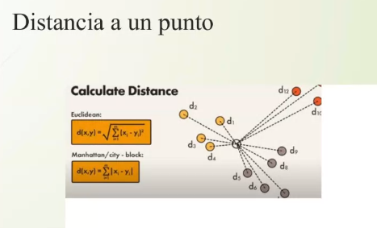
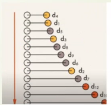
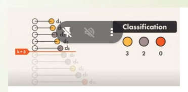
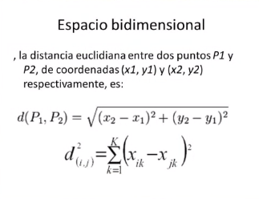

## Clase 06

Nos muestra el algoritmo K vecinos más cercanos (knn)

Va a poder predecir en base a un conjunto de datos.

Eje cartesiano:

Nube de dispersión.

Los puntos van a estar agrupados por características en común.

Distancia entre un punto:

Ordenamiento:

Clasificación según K:

Fórmula para obtener la distancia entre dos puntos:

Después empezamos con Google Colab.

Sigo en el documento.