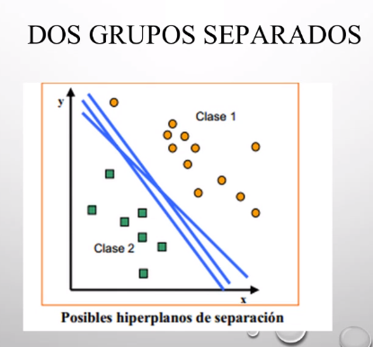
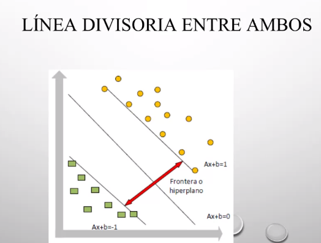
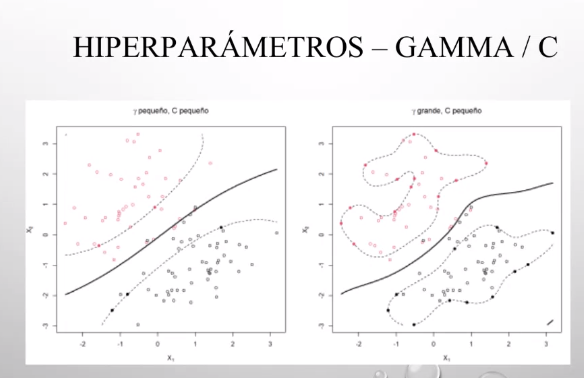
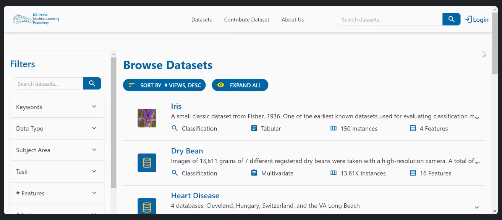

## Clase 07

Menciona temas que entran al parcial:

IA: conceptos principales
Sistemas expertos
Complejidad computacional
Aprendizaje automático
Redes neuronales
Perceptrón multicapa
K vecinos más cercanos (knn)

19 de junio (oral online)

---

### Máquina de soporte vectorial

Margen rígido (escenario ideal, los puntos están bien separados).

Funciones polinómicas para separar con una línea curva:

(underfitting y overfitting)

Son parámetros que se van ajustando.

Muestra ejemplos de datasets:

