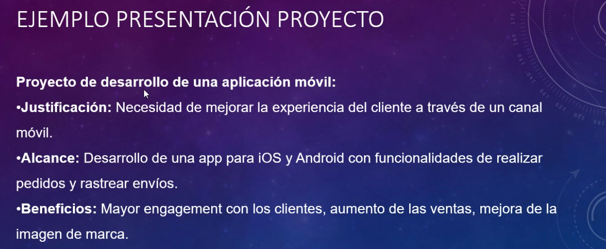
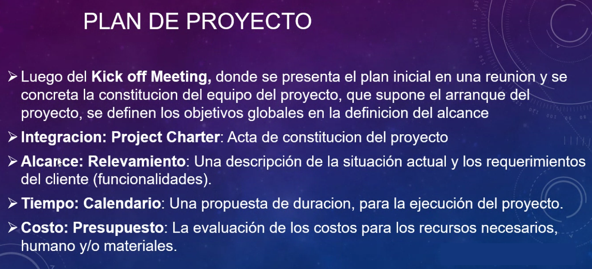

## Clase 02

Virtual. Vemos el primer TP.

Fecha de entrega: 25/04/24 a las 23:59hs

Inicio: aprobación y definición del proyecto

Cada item está referenciado en el PMBOK por capítulos.

### Procesos de gestión de la integración

Escucha activa del cliente y el negocio. Identificamos necesidades.

Hay que sacar los supuestos. Qué incluye y qué NO INCLUYE el proyecto. No deben haber supuestos, tiene que estar explícito.

### SMART

Plantear los **objetivos** de desarrollo para que sean específicos, medibles, alncanzables, relevantes y temporales.

### Acta de constitución del proyecto 

Problema y solución. Ponemos fechas. Quién hace el trabajo.

### Stakeholders

Identificar a los interesados

Registro de interesados:

Clasificación:

Con este relevamiento podemos hacer una matriz de stakeholders:

### Entregables del incio

Generamos entregables:

### Kickoff

Se da inicio al proyecto con una reunión:

Ejemplos de presentación de proyecto:

(..break)

### Planificación

Gestión del alcance del proyecto.

Requerimientos del usuario y requisitos del desarrollo.

Definimos el alcance. Qué queda fuera de alcance?

Crear las Estructuras de Trabajo

Validar el alcance

Controlar el alcance

### Plan de proyecto

Ya tenemos relevado el aclance, hay que hacer un detalle completo.

Con el relevamiento podemos conocer las funcionalidades, asignarles una tiempo a cada una y planificar la entrega final.

Costo más detallado.

#### Pasos de la planificación predictiva (cascada)

1. Definir el problema que debe resolver el proyecto
2. Definir la solución con su alcance
3. Definiar las tareas y entregables
4. Elaborar una estructura de desglose del trabajo (EDT/WBS)
5. Calcular la duración de las tareas
6. Secuencia las tareas (precedentes y sucesoras)
7. Desarrollar red de tareas (PERT/CPM) y el camino crítico
8. Estimar las necesidades de recursos para cada tarea
9. Estimar los costos de cada tarea
10. Preparar el calendario del proyecto y el presupuesto
11. Definir técnicas y herramientas de seguimiento y control
12. Decidir el equipo de trabajo
13. Conseguir la aceptación del plan por el cliente

### Requerimientos de un sistema

- Requerimientos del usuario (necesidad)
- Los requerimientos son descripciones de lo que el sistema debe hacer y sus restricciones, según lo expresa el usuario o según identifica el equipo del proyecto
- Los requerimientos deben ser:
    - Medibles
    - TBD

Recabar requerimientos:

Tareas para recabar estos requerimientos:

Requisitos de Software:

### Requisitos según enfoque

Hacer minuta de reunión (!)

### Especificación de requisitos

Guardar toda la información para próximos desarrollos:

### WBS

Muestra ejemplo de WBS detallado en MS Project

Muestra ejemplo de minuta

---

Para la próxima clase tener avance del TP1