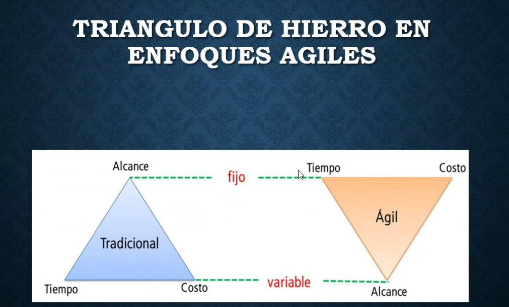
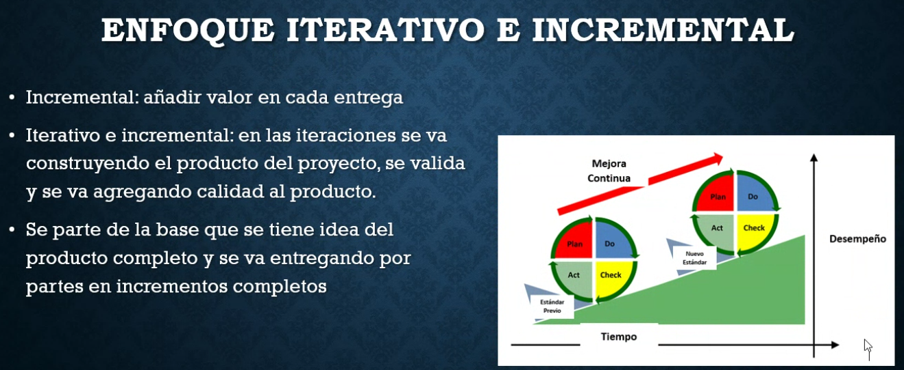
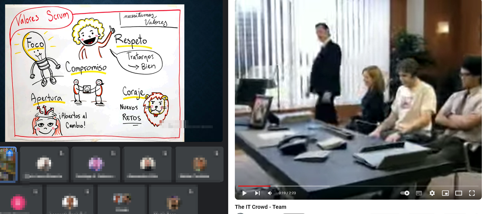

## Clase 06

El tema general es Agile.

Vemos temas blandos relacionados a nuevos modelos de negocios (economía de plataformas), metodologías, lean, startups, etc.

Comenta características de un MVP. El tema de la validación de producto, entrega continua de valor.

Vuelve a detallar bien Scrum, muestra kanban, triángulo de hierro (en agile tiene otra forma ver diagrama)

Ciclo de Deming

PDCA (Plan Do Check Act)

Enfoque iterativo:

valores scrum y teams teams teams

Artefactos de Scrum: Product backlog, Sprint backlog, Increment

