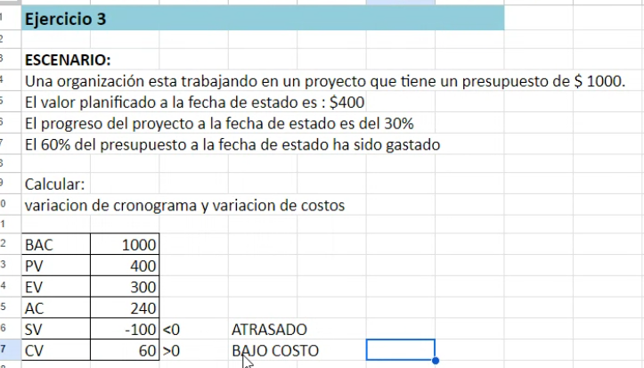

## Clase 07

Repasamos un par de temas:

Hitos

Nos muestra cómo incluirlo en project libre:

Creamos reuniones de avance con days 0, que dependa de la fase anterior. Eso agrega un rombo negro que indica que es un hito.

Se lleva un informe de avance del proyecto a esta reunión de avance, que se llama "Fecha de estado".

Redactamos informe de avance, se hacen solicitudes de cambio.

El reporte inclue estado de las tareas, progreso, ponósticos.

Informe de desempeño del proyecto. En cuanto a costo y en cuanto a tiempo.

- Sobre costo o bajo costo.
- Adelantado o atrasado según el cronograma original

Para eso usamos el Método de valor ganado.

Valor ganado maneja 3 valores:

- Planificado
- Real
- Ganado

Índice de desempeño

- Costo
- Desempeño del cronograma

---

Vamos a ver ejercicio de Valor ganado con una hoja de cálculo que nos muestra:

Dejo el archivo en assets.

Otro ejercicio (tiene una trampa, este es de la certificación de PM)

Valores a comparar en Project Libre:

---

Al final comenta un poco del parcial, son ejercicios de proyecto y PERT + múltiple choice del contenido teórico.