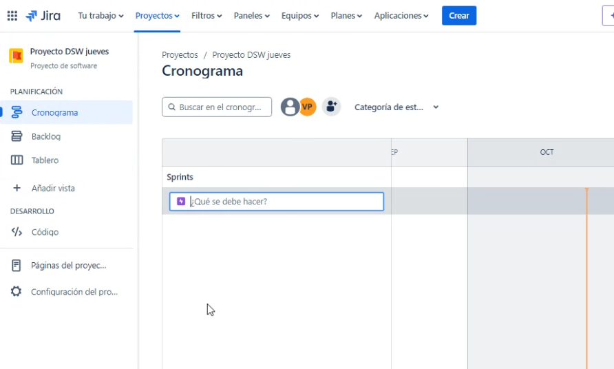
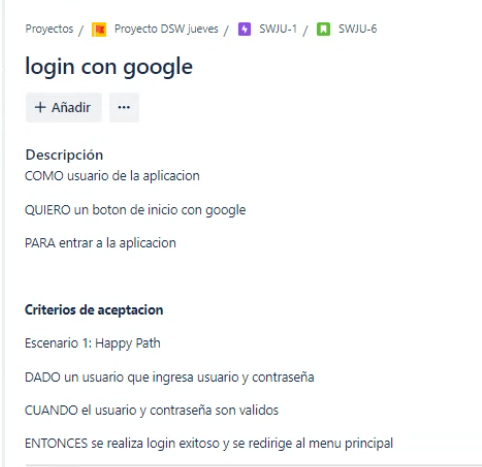
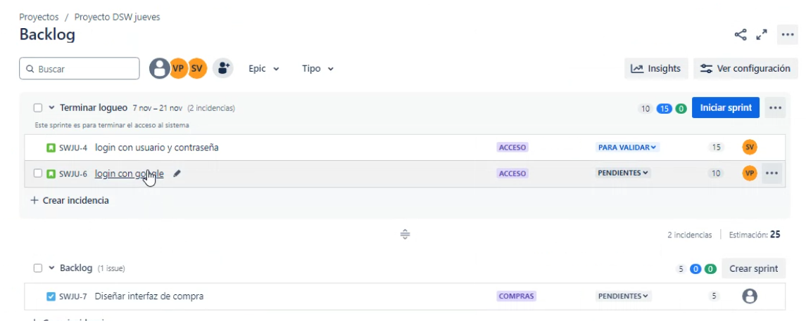
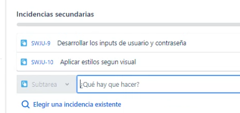

## Clase 09

Comenta temas de parcial. Después todos los grupos tienen devolución de los TP con PERT, WBS y project libre.

En nuestro caso tuvimos que re-hacer todo el diagrama PERT. No lo subimos. Quedamos en subir el nuevo doc completo.

Comenta las consignas del TP.

Empezamos a ver Jira, carga epicas, tareas, story points, responsables, info de la card, DoD

Añade subtareas (incidencia secundaria)

Agrega comentarios a la historia.

