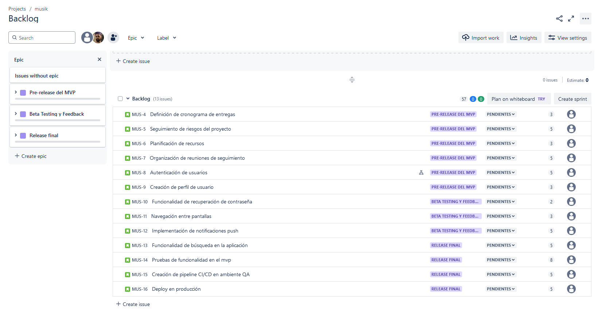
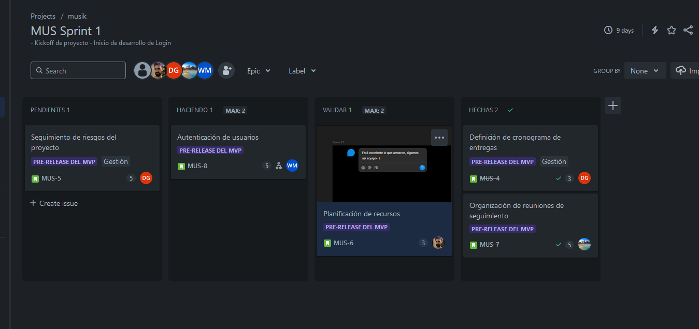

## Clase 10

Avanzamos con mi equipo en el backlog del TP de Jira:

Tenemos que hacer la simulación de sprints y planning. También tenemos que corregir lo que falta de project libre.

---

Seguimos viendo correcciones de otros TP de compañeros.

---

Comenta tema fechas, nos tocó el 21-11 y pedimos que nos adelanten al 14-11

Seguimos con grupo armando el Jira y nos queda todo ccmpleto para la defensa:

TODO:

- Armar figma slide para defensa del tp