## Clase 03

Repasa lo que vimos la clase pasada. Consulta status del TP. 

WBS: Work Breakdown Structure
EDT: Estructura de desgloce de trabajo

PERT: Red de tareas
CPM: Critical path method

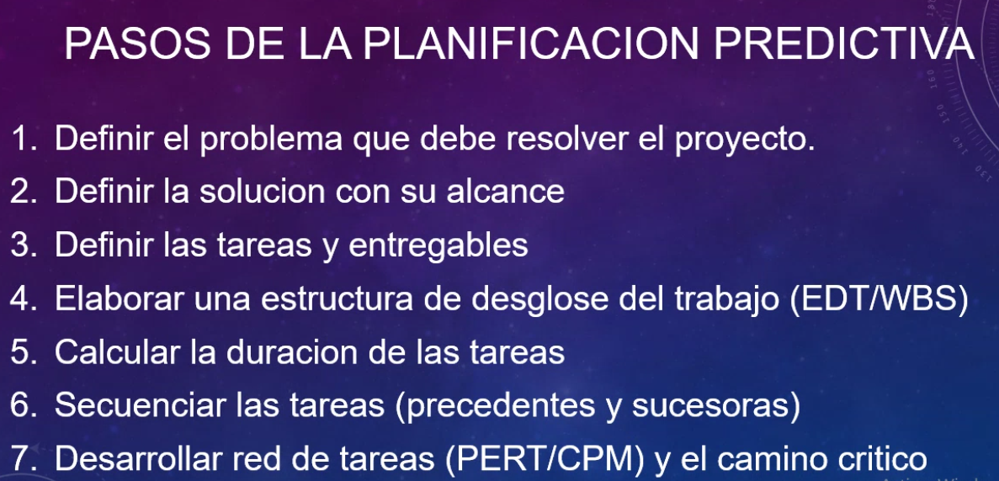

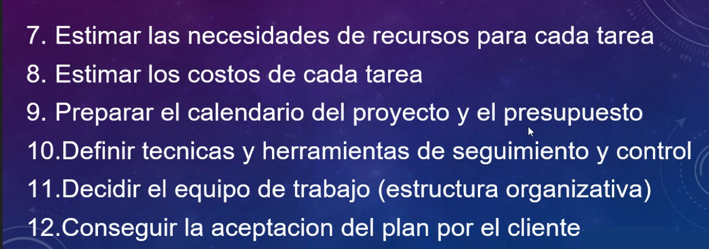

Vamos a hacer el cálculo interno que hace el sistema de PM como Project Libre o MS Proyect.

En el punto 9: se hace un detalle del plazao de entrega y el monto (ej: 124 días, 52300usd, en vez de rangos más amplios como en la primera etapa).

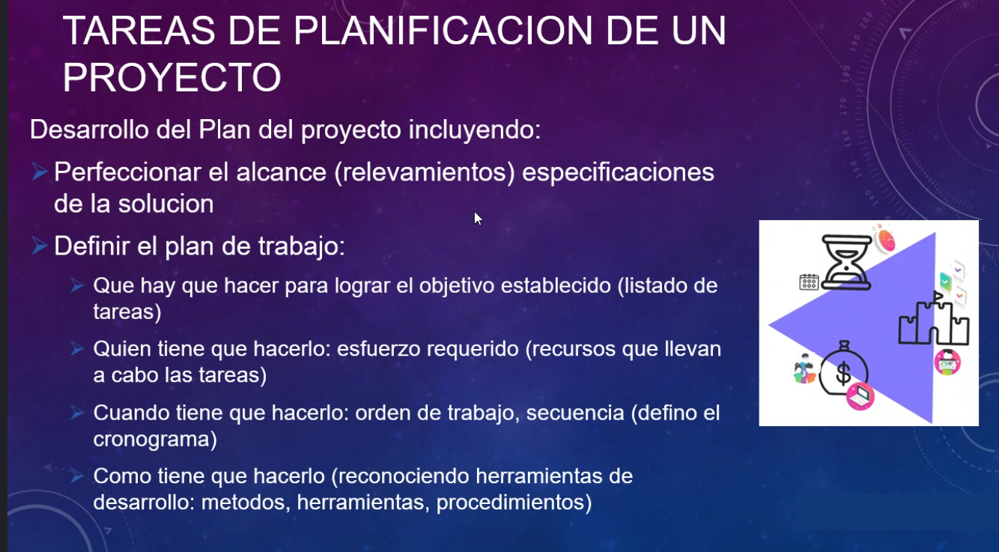

El plan está más detallado.

Línea de base de costo y presupuesto

En el presupuesto hay que agregar la 'reserva de gestión'.

En un primer paso hacemos un análisis amplio:

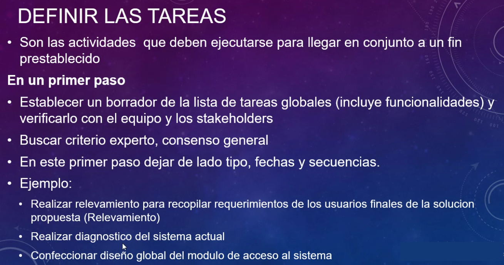

después vamos más al detalle:

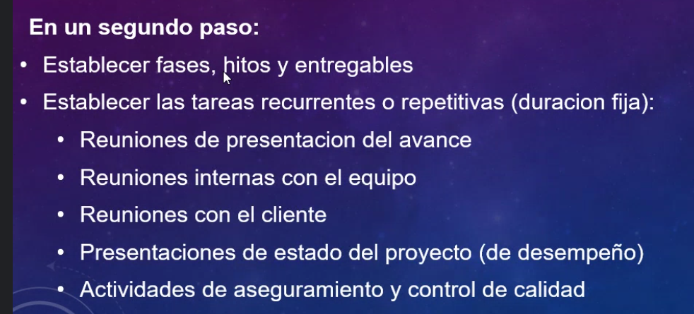

Cómo se está desempeñando el proyecto:

- En tiempo
- En costo

Se están cumpliendo los requisitos definidos?

Último paso, mucho más específico:

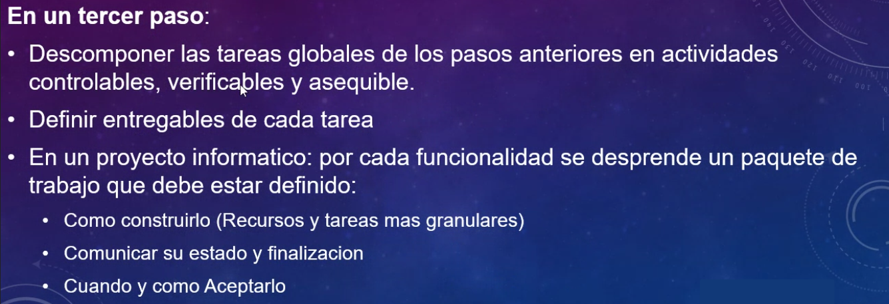

Descomposición de tareas:

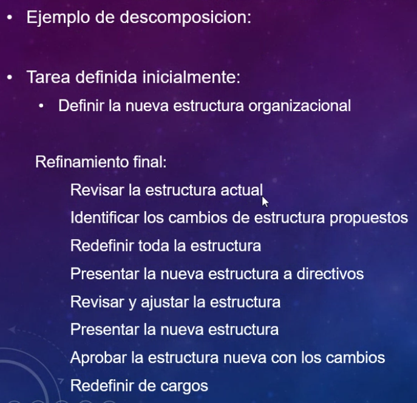

Ficha de atributos de cada tarea:

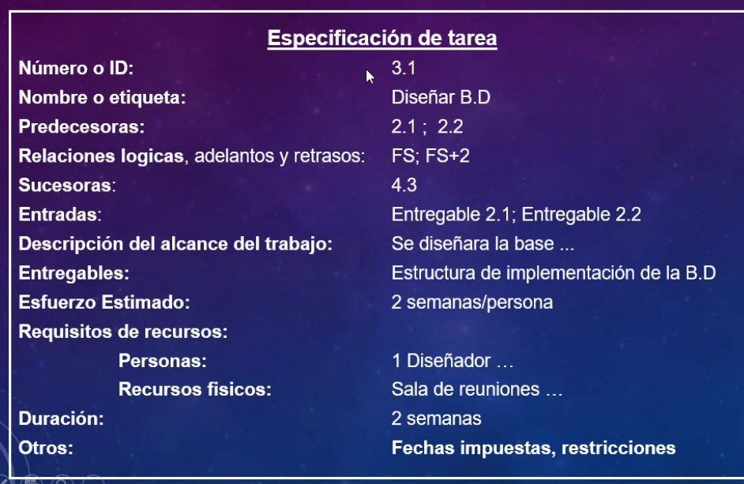

Esta relación la sacamos de WBS.

Ejecución, seguimiento y cierre:

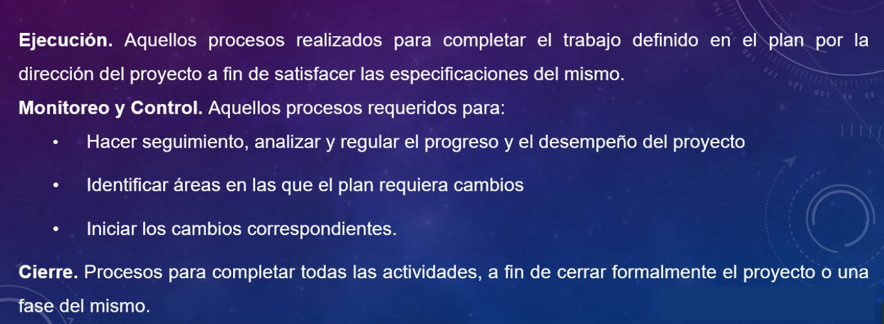

Cerramos formalmente el proyecto y que el cliente firme que está conforme con el producto recibido.

Ejecución del proyecto. 

Asignación de roles y responsabilidades a los colaboradores.

Gestión de colaborades de los recursos:

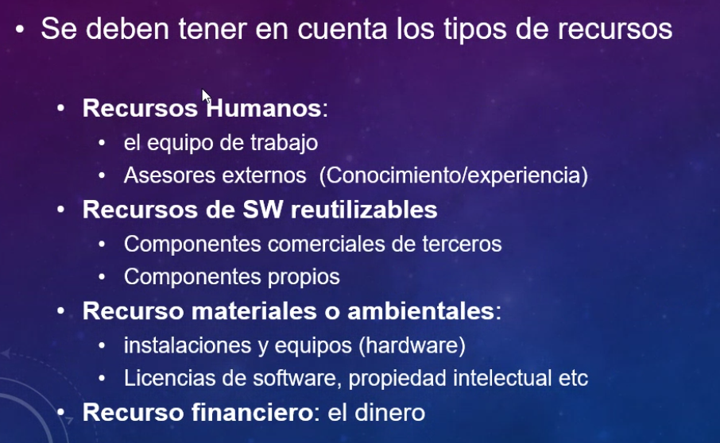

Matriz R.A.C.I.

Responsable, accountable, consulted informed

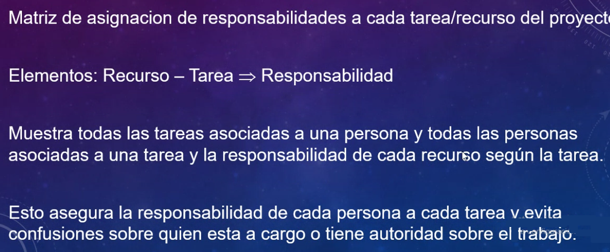

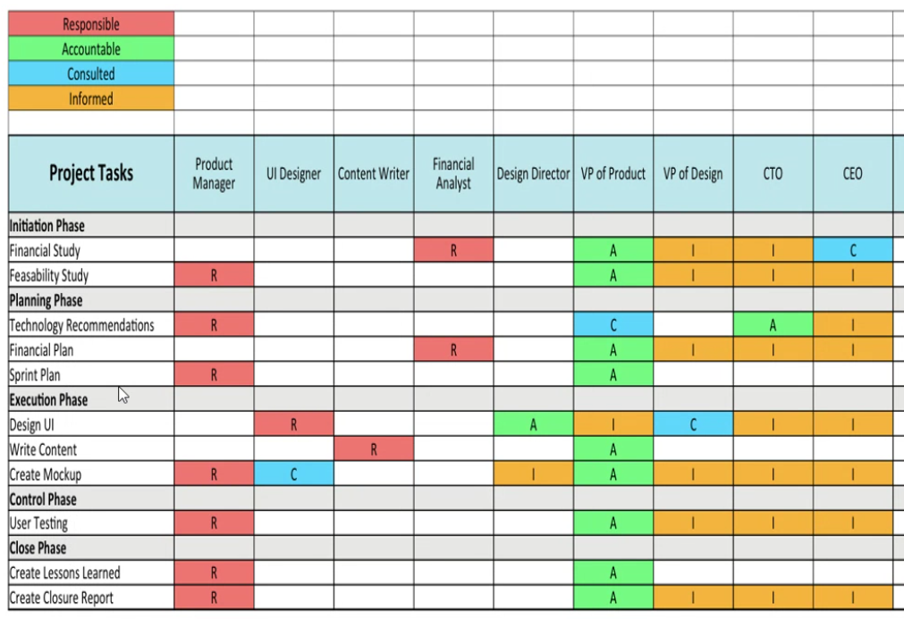

Organigrama del proyecto:

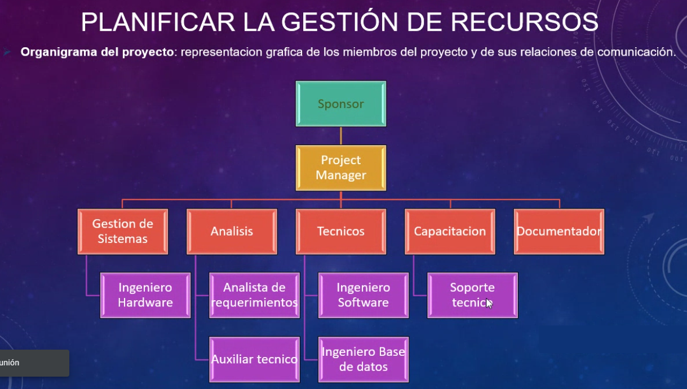

Pone ejemplos de roles en un proyecto:

- PM
- Analista
- Arquitecto
- Desarrollador
- DBA
- Arq. Cloud
- QA

etc

Hitos / Milestones

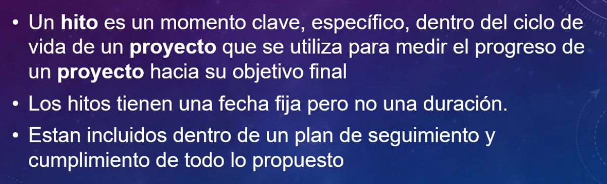

Informe de avance del proyecto:

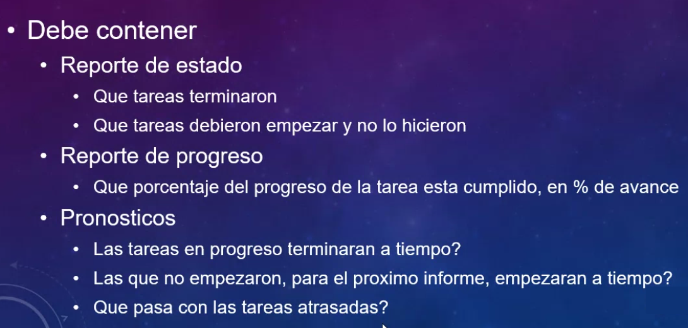

Informe de desempeño del proyecto:

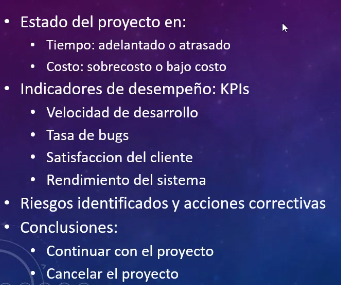

Continuar el proyecto o cancelarlo?

Seguimiento: monitoreo y control

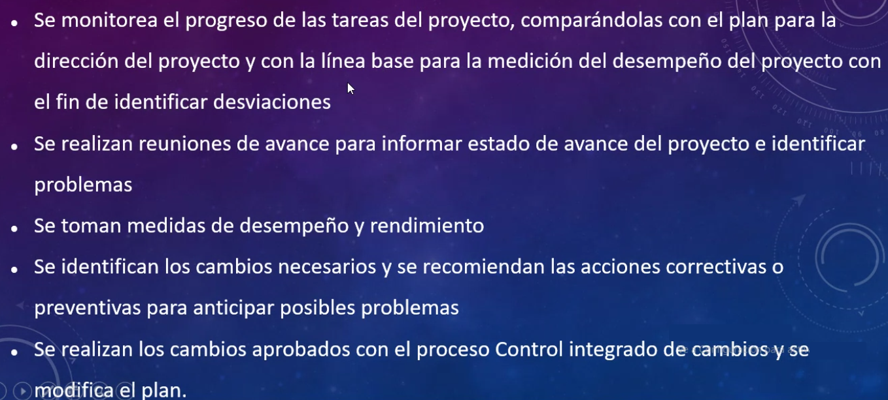

Cierre del proyecto:

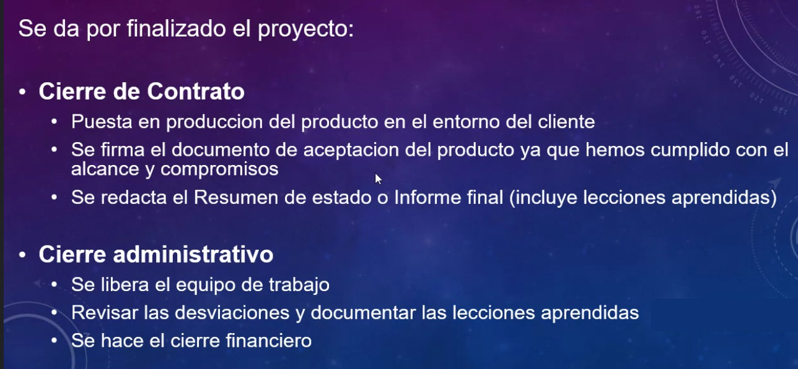

Resumen del estado:

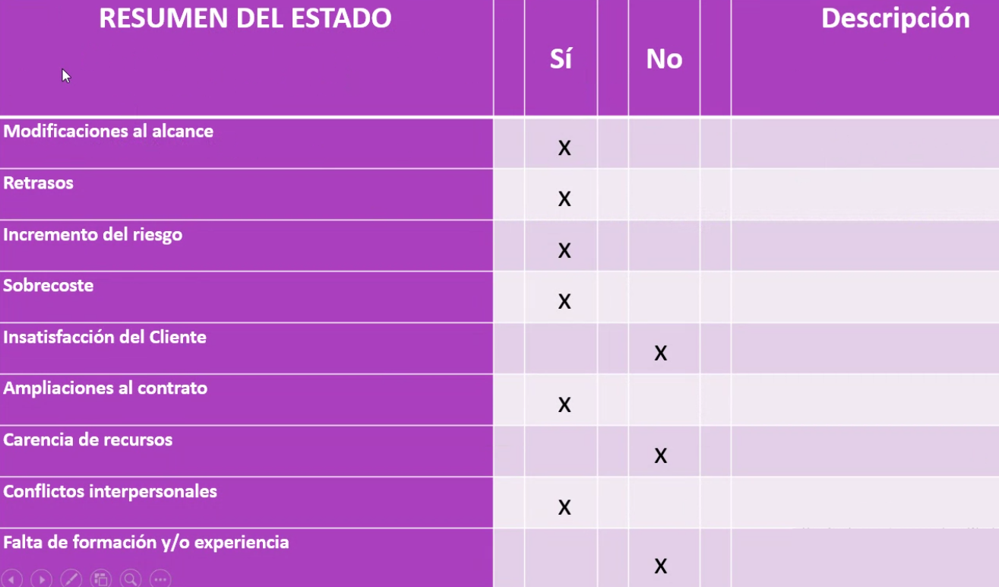

Ciclo de vida de un producto informático:

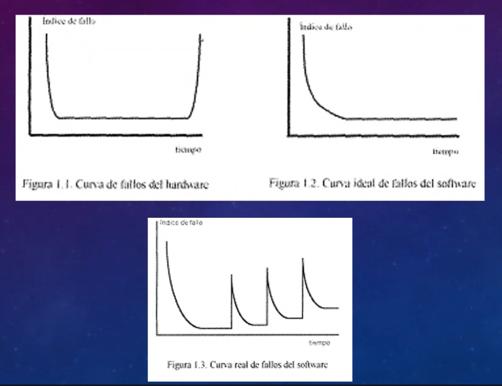

---

Próximo jueves vemos red de tareas.