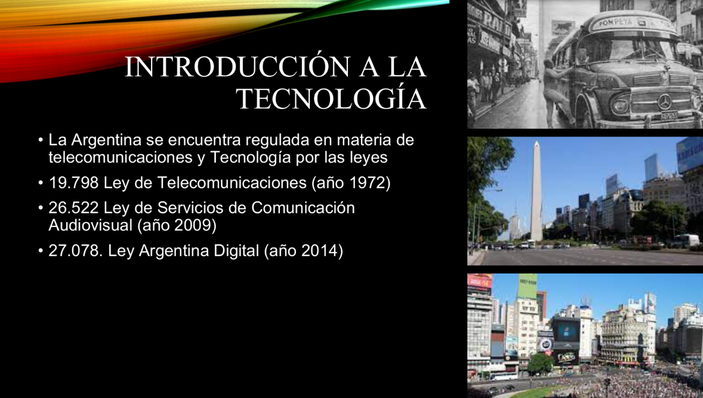
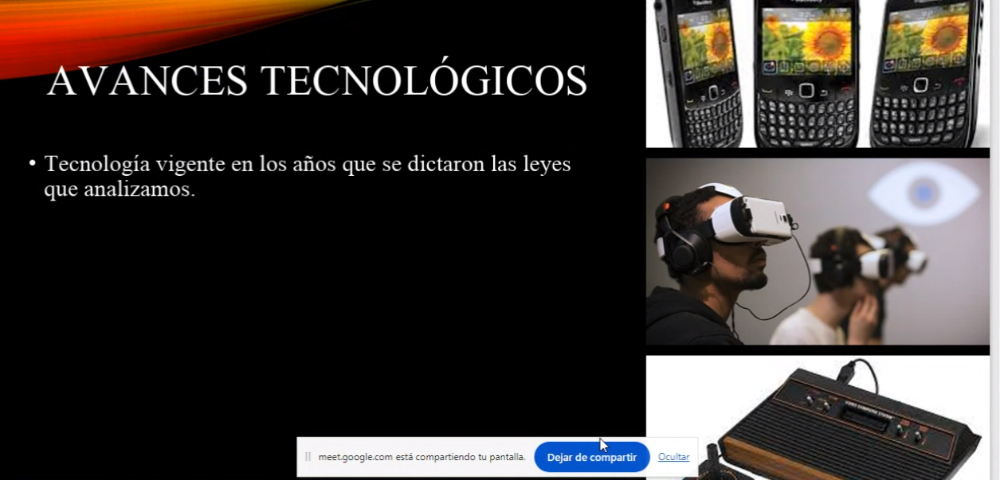
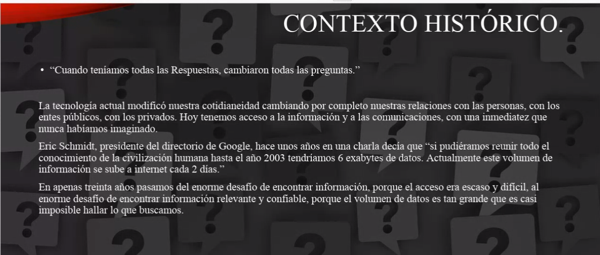

Comienza la llamada haciéndonos presentar entre toda la clase.

Explica cuestiones básicas de aprobación de materia.
2 parciales, recuperatorios, promoción. Todo esto es igual que el resto de las materias.

1er parcial multiple choice
2do parcial presentación de trabajo
final: defensa del TP final (grupal)

> Si se puede promocionar, la defensa del final se hace el día de la presentación
> Va a chequear con el ifts si se puede promocionar (casi seguro que sí)

Muestra el programa de la materia:

https://drive.google.com/file/d/1BSgrcosguBDffrwsNyoFVwn-9s_fdfNd/view



Menciona cambios en los medios de comunicación, en las plataformas, en el acceso masivo a internet.



Pone ejemplo del ex CEO de Google hablando del almacenamiento total de información de toda la historia de la humanidad y cómo es mínimo en relación
a la cantidad de contenido que se sube año a año a Internet en la actualidad. 

Busco la cita real, aparece en un articulo interesante para chequear: Esto está interesante: [Was Eric Schmidt Wrong About the Historical Scale of the Internet?](https://readwrite.com/are-we-really-creating-as-much)

```
“There was 5 exabytes of information created between the dawn of civilization through 2003, but that much information is now created every 2 days, and the pace is increasing.”
```



Cierra la clase diciendo que para la próxima tratemos de tener los grupos armados y el tema elegido.