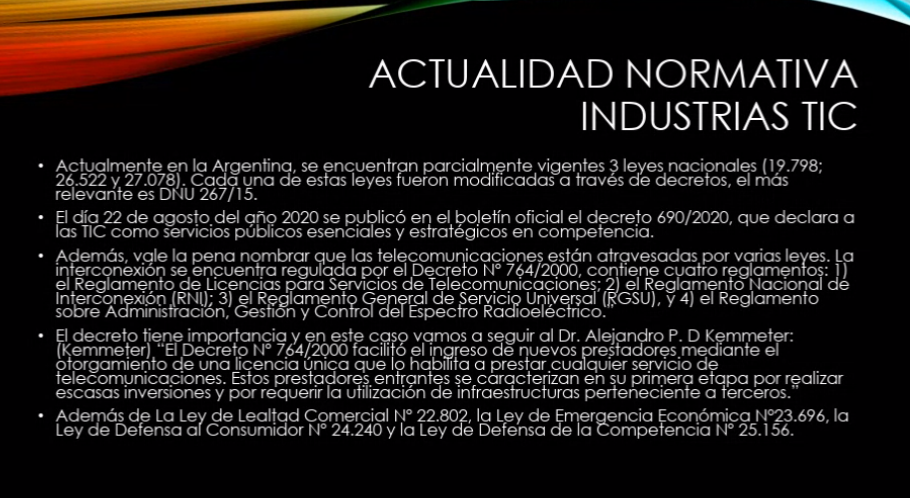
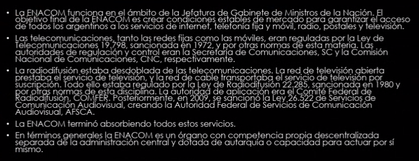
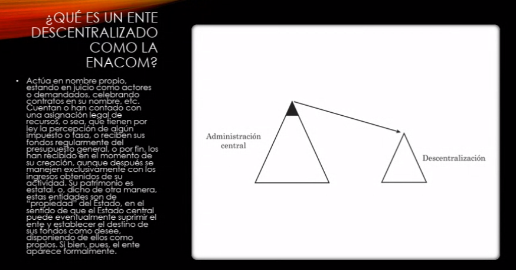
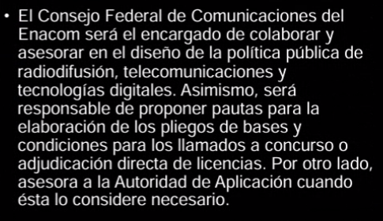
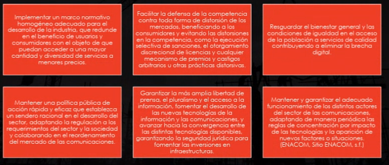
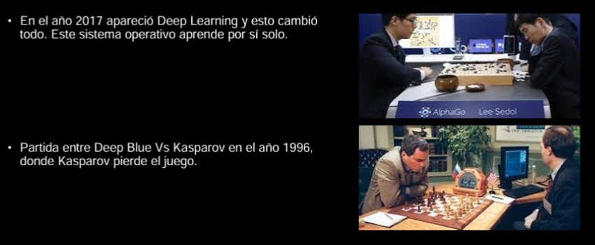
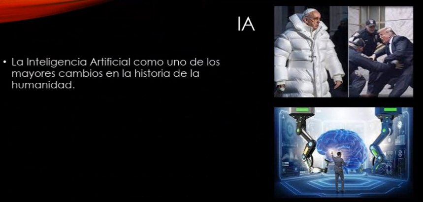
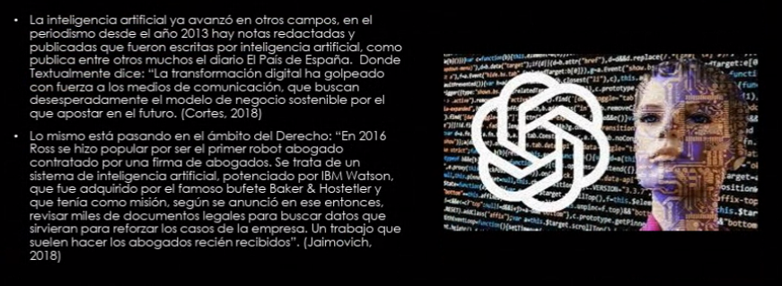
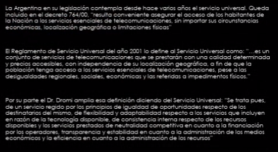

## Clase 02

Empezamos viendo la presentación con normativas vigentes en Argentina:

Qué es la Enacom:

https://www.enacom.gob.ar/

https://es.wikipedia.org/wiki/Ente_Nacional_de_Comunicaciones

- Es descentralizado
- Está por fuera del aparato estatal

Consejo Federal de las Telecomunicaciones de Enacom

Qué hace el consejo?

Empezamos a hablar de IA:

https://www.bbc.com/mundo/noticias/2016/03/160312_alphago_inteigencia_artificial_go_victoria_humano_men

https://medium.com/@l2k/how-machine-learning-beat-the-world-s-best-go-player-f1a82061c099

La comunicación como Derecho Humano básico

Termina la clase hablando un poco de IA y cultura, cómo nos está afectando a nivel social.