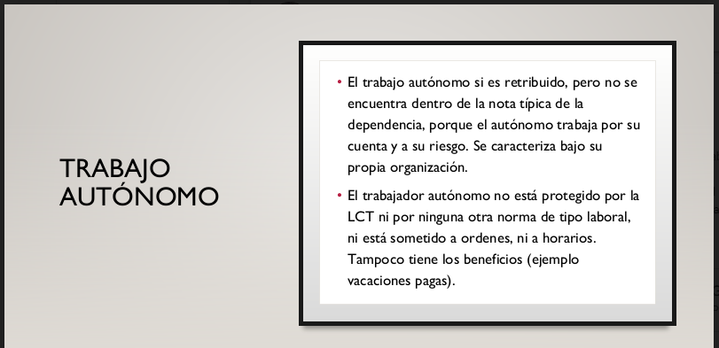
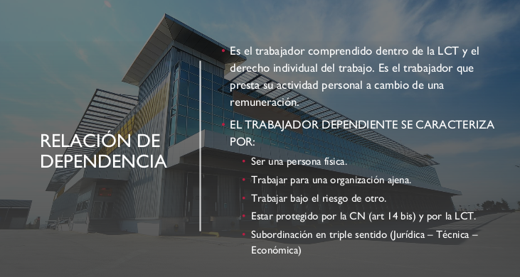
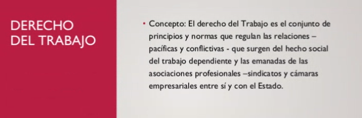
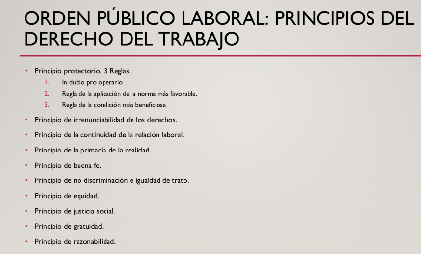
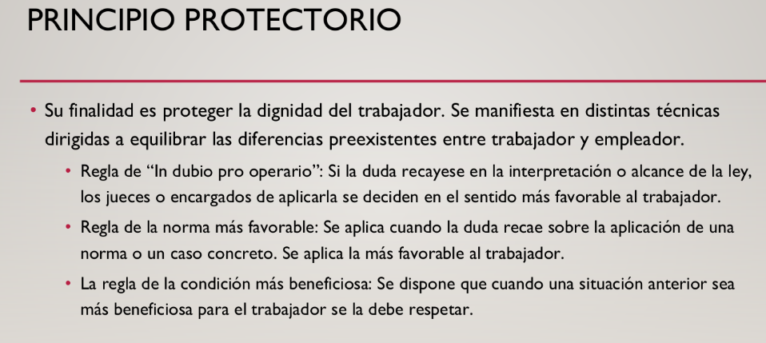
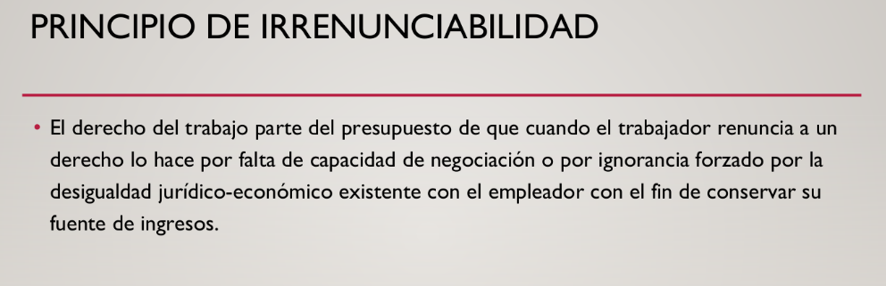

## Clase 03

El tema principal de la clase es la legislación vigente referida al trabajo.

Empieza comentando la revolución industrial y el fordismo. Cómo el obrero de esa época tenía pocos o nulos derechos.

Vemos un video de un estudiante que se recibió de arquitecto en la UBA, el primer egresado del barrio 31. Pone ejemplos de cómo se relaciona con la sociedad post-industrial.

Seguimos con la ley de trabajo:

Principios que rigen las relaciones de trabajo

Son principios que rigen todo el derecho laboral. El marco laboral tiene que estar encuadrado en estos principios:

Ante la duda, el derecho está a favor del trabajador:

No se puede renunciar a los derechos adquiridos:

Seguimos hablando de derecho laboral en relación al rubro IT. Los convenios colectivos, los sindicatos que existen (o los que no llegaron a nada).

Se arma un debate sobre la responsabilidad jurídica en las apps de servicios como rappi, uber, didi moto, etc.