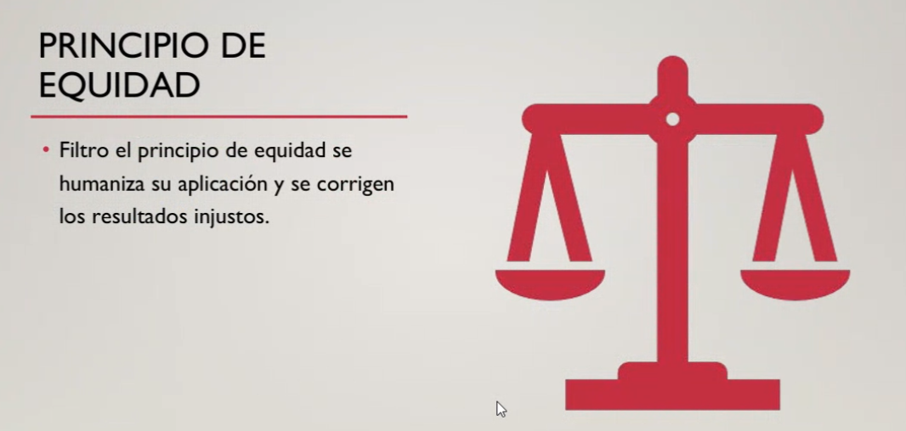
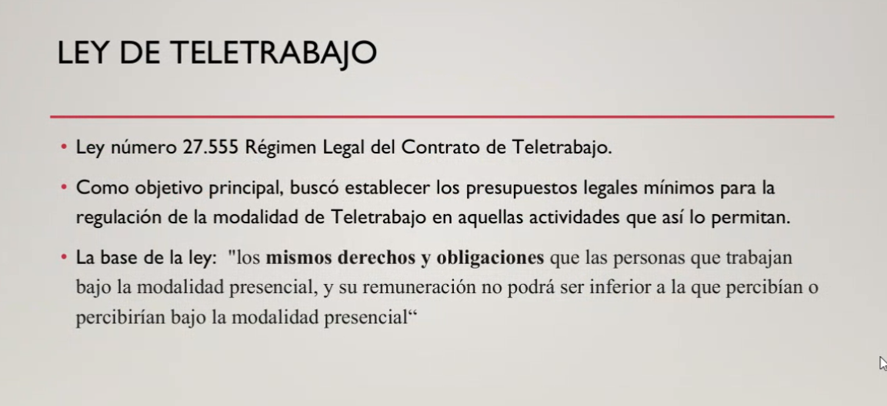
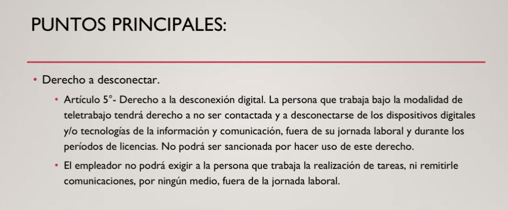
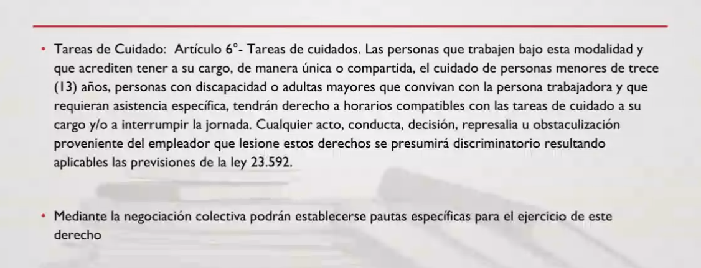
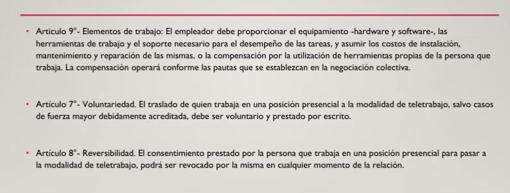

## Clase 04

Retomamos la clase anterior con el tema derecho laboral.

Hablamos de primaciía de la realidad.

Ejemplo si estás no registrado pero tenés pruebas de que trabajás en relación de dependecia "de facto" se puede demostrar que se aplica este principio.

El principio de buena fe indica que empezamos la relación laboral sin intención de perjudicar a la otra parte.

Principio de no discriminación e igualdad de trato.

Este principio trata de reparar las desigualdades dentro del ambiente laboral.

Terminamos hablando de los temas para los TP. 

Hay que plantear un hipótesis para el próximo miércoles.