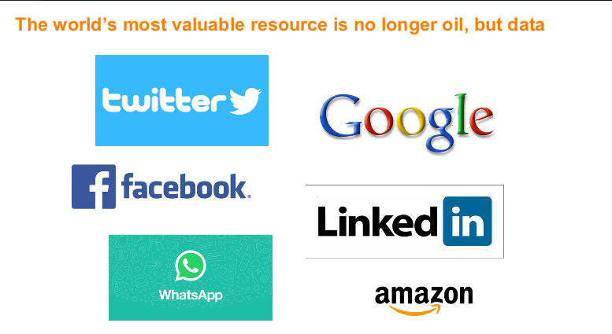

## Clase 05

Privatización y desregulación de las Telecomunicaciones

Pone en contexto la telefonía antes de las privadas (malos servicios, días para hacer una llamada, etc.)


Luego la ola de privatizaciones (que pone en contexto mundial del modelo hegemónico de Europa y EEUU), se dividen en dos grandes empresas en el norte y el sur del país:


Tomado del PPT:

```
La Privatización apunto a lograr la modernización del sistema de telecomunicaciones en base a inversiones privadas. La búsqueda fue alcanzar el desarrollo de las telecomunicaciones locales, interurbanas, internacionales.

La privatización de ENTel, que fue instrumentada, por el Decreto 731/89 y su modificatorio 59/90.

Señala Dromi (1997) que la concesión del servicio público, en este caso, implicó el monopolio y la exclusividad. El monopolio, en virtud de la supresión de la competencia pública o privada; la exclusividad, traducido en el compromiso por parte de la Administración de no otorgar nuevas concesiones para el mismo servicio.
```

### Marco regulatorio - línea de tiempo

```
Veámoslo como línea de tiempo:

La primera modificación viene de la mano de la privatización de Entel, que fue instrumentada, por el decreto 731/89 y su modificatorio 59/90.

La segunda etapa se abre con el decreto 264/98 en búsqueda de abrir la competencia en el mercado de las
telecomunicaciones.

La tercera etapa comienza con el decreto 764/00 con el cual se dispone la desregularización del servicio de telecomunicaciones se aprueban los Reglamentos de Licencias para Servicios de  elecomunicaciones, Nacional de Interconexión, etc.
```

Un campañero pone como contra ejemplo de la situación actual de las teclco el caso de Alemania:


### Principios que rigen la competencia telefónica

- Exclusividad Acotada: Desde el inicio en la privatización se pensó en la división de las zonas del país en miras del desarrollo.

- Competencia Leal: Paso el periodo de exclusividad se abrió el mercado a la competencia de distintos actores.

- Desregulación y liberación: dos tópicos permanentes en las privatizaciones.

- LA OMC y las Telecomunicaciones: Es el marco institucional en el comercio de las telecomunicaciones.

Se menciona la "carterización" de clientes cautivos. Al rededor de 20M de clientes cada empresa.


### A nivel local (Provincia de Buenos Aires)


Ordenznas en la distribución a nivel localidades en la privincia de Buenos Aires y todo el país.

```
Los municipios de todo el país, a través de sus Honorables Consejos Deliberantes (en adelante HCD), han  mitido ordenanzas en materia de despliegue de infraestructura de telecomunicaciones.
```


### Marco Normativo de los municipios

```
- En efecto, para sostener la competencia municipal, los HCD hacen referencia a la autonomía Municipal en el marco Constitucional, que en modo alguno se pone en cuestión.

- La Constitución Nacional garantizan el Régimen Municipal de manera autonómica en los artículos 5º y 123 de la Constitución Nacional.

- Los municipios subsisten de los recursos económicos que imponga, a través de tasas, con arreglo de las
disposiciones de la Constitución Provincial, resultan tener así una presunción de legalidad que descalifica cualquier intento de menoscabar dicho poder, atento las finalidades que se atienden con los recursos presupuestarios de cada uno de los municipios.
```

Link Youtube: https://www.youtube.com/watch?v=q04zkynjfgi

Ley de convergencia (hasta el 2017)

https://www.enacom.gob.ar/leydecomunicaciones#:~:text=La%20Ley%20de%20Comunicaciones%20Convergentes,interdependencia%20en%20perjuicio%20del%20aislamiento.

