## Clase 05

Nos comenta que hacemos parcialito la semana que viene.

El parcial real queda para el 15-05

Empezamos la clase hablando de protección de datos personales:

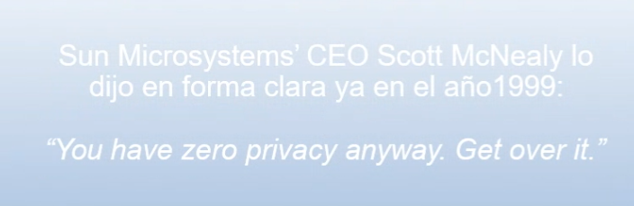

Real:


Seguimos charlando de datos personales recopilados por las apps:

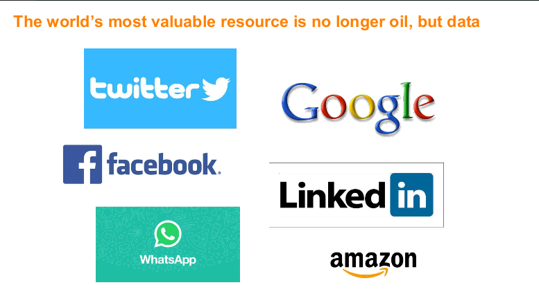

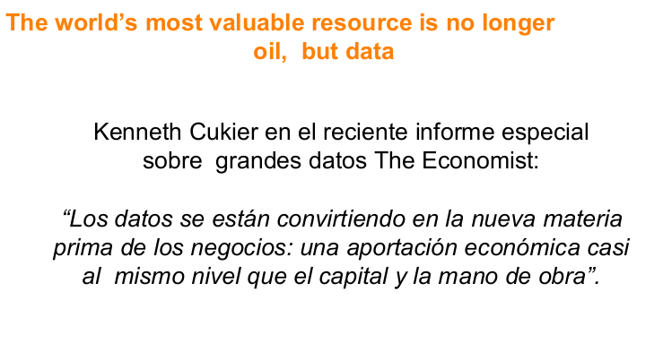

Se menciona el caso Cambridge Analaytica

```
Escándalo Facebook – Cambridge Analytica

*Una investigación realizada por el diario The New York Times y The Observer, la edición dominical del  eriódico británico The Guardian, reveló que Cambridge Analytica usó los datos de 50 millones de usuarios de Facebook para desarrollar software para predecir e influir en los votantes. 

*App que al bajarla tomaba información.

*Tras las revelaciones, Facebook suspendió el acceso a sus servidores a CA.

*Facebook sostiene que las transmisiones de datos personales que se realizaron constituyen una  violación" de sus condiciones de utilización y prometió que tomará acciones en la justicia, "si es necesario".

```

Habla un poco de la llegada de Trump al gobierno de EEUU

Comenta caso whatsapp:

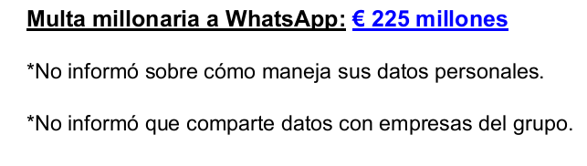

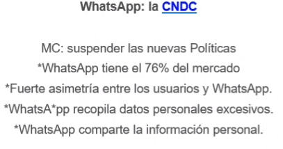

Se arma debate sobre medios tradicionales y nuevas formas de comunicación

Luego pasa a hablar de:

- Europa (GDPR)
- EEUU (caso safe harbor)
- Argentina (ley PDP y +)

Se menciona caso EEUU:

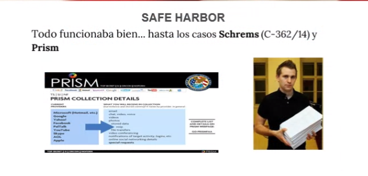

Casos locales de ARG:

```
Acción de Habeas Data: artículo 43, tercer párrafo, de la Constitución Nacional, en oportunidad de la Reforma Constitucional del año 1994 – antes en el art. 19. 

Ley N° 25.326 de Protección de Datos Personales, norma de orden público que regula los principios aplicables en la materia, así como también el procedimiento de la acción de hábeas data cuando corresponda la jurisdicción federal. Año 2000. 

La mencionada ley ha sido reglamentada por el Decreto N° 1558/01, modificado por su similar N°1160/10.

Disposiciones dictadas por la Dirección Nacional de Protección de Datos Personales y Resoluciones de la Agencia de Acceso a la Información Pública.

En el año 2014 se sancionó la Ley N° 26.951, que creó el Registro Nacional "No Llame”, reglamentada por el Decreto N° 2501/14, completándose también con las disposiciones dictadas por el Dirección Nacional de Protección de Datos Personales.

Código Civil y Comercial de la Nación y Código Penal
```

Menciona Argentina como ejemplo (poniendo en duda obviamente) mencionando que en algún punto fue vanguardia en la región.

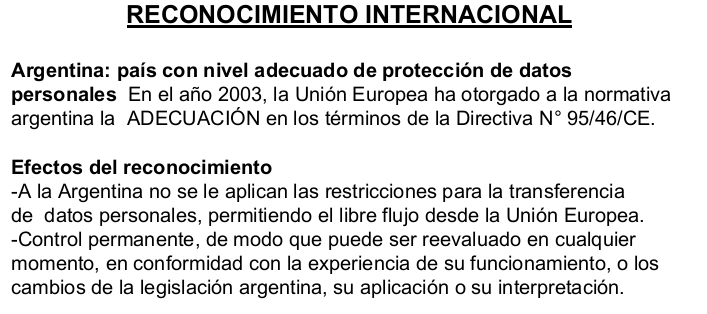

Menciona caso agencia de información pública:

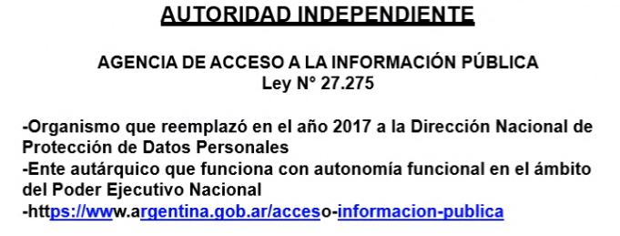

### Datos personales y Datos sensibles

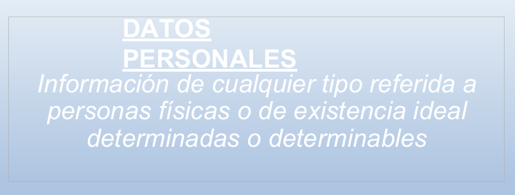

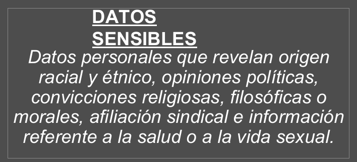

### Tratamiento lícito de datos personales:

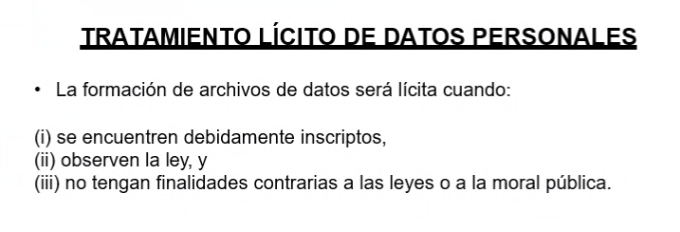

Los casos lícitos:

Se encuentran inscriptos y hacen uso de los datos dentro del marco de la ley.

Menciona consentimiento expresado en el artúculo 3 resolución 906/98

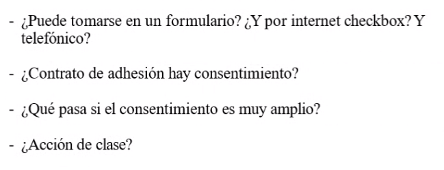

- Consemtimiento amplio
- Acciones de clase (acciones en conjunto para defender tus datos personales)

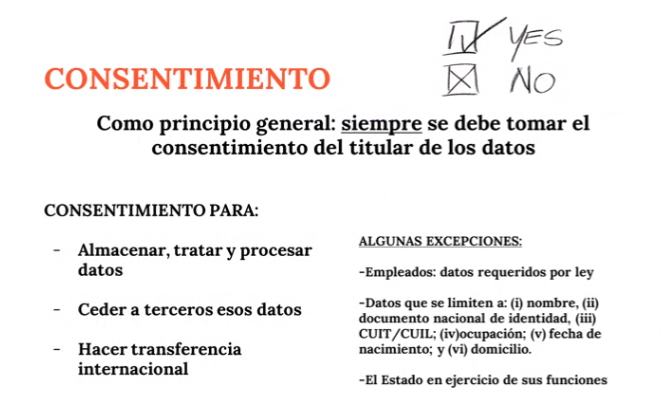

Las personas están dentro de la ley del consumidor. Se supone que uno está en desventaja con la empresa que está brindando su servicio.

#### Excepciones publicidad

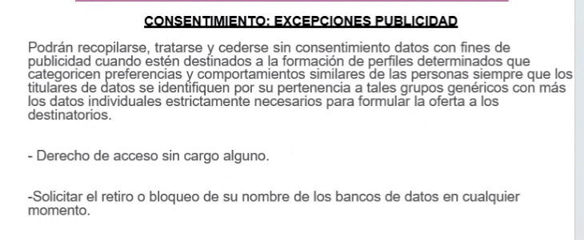

Se cruzan datos entre empresas

