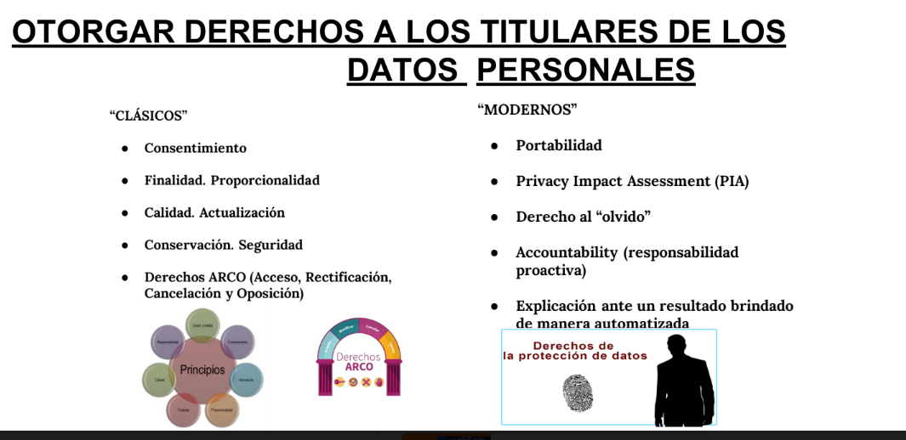
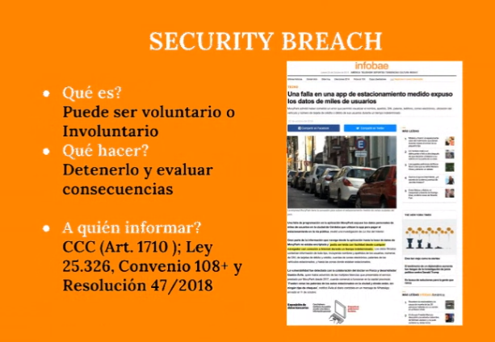
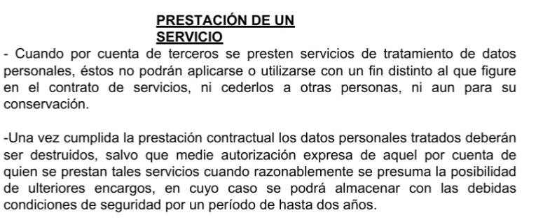
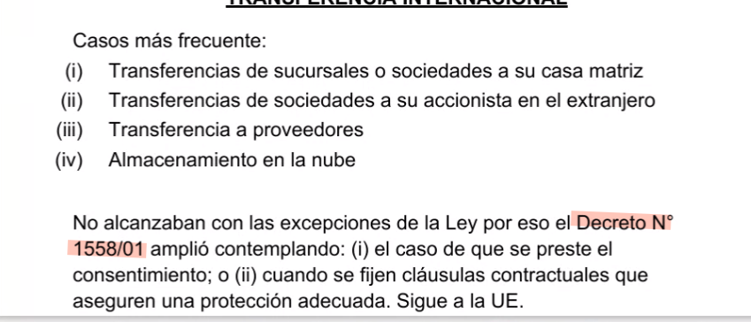

## Clase 06

Nos muestra cómo va a ser el parcial.

Empezamos la clase hablando de cookies.

Menciona cómo funcionan las cookies, su relación con GDPR.

Después sigue con datos personales, modelo clásico y moderno.

Se menciona el "derecho al olvido" y el caso de Natalia Denegri: https://www.infobae.com/sociedad/2022/06/28/derecho-al-olvido-la-corte-suprema-revoco-la-sentencia-que-favorecia-a-natalia-denegri/

Limites en la recolección:

Los datos personales que se recojan deben ser:

(i)ciertos, adecuados, pertinentes y no finalidad para los que se hubieren o ido.
(ii)Recogidos utilizando medios leales, forma contraria a la ley.
(iii) Utilizados para la finalidad que motivaron su obtención.
(iv) Exactos y actualizarse en el caso de que ello fuere necesario.

Pone ejemplo caso Cencosud. Otro sobre una falla en un estacionamiento medido de la ciudad:

Otras sanciones conocidas:

- Yahoo
- Linkedin
- etc

Prestación de servicios:

Transferencia internacional. Se pueden compartir datos personales ante "riesgo de terrorismo".

Da más info sobre el parcial y cortamos ahí.