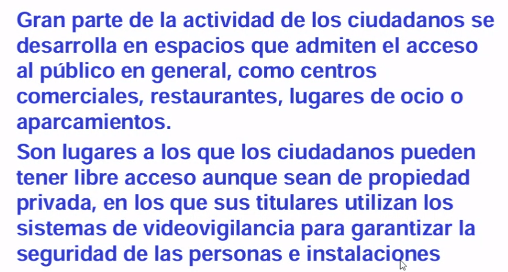
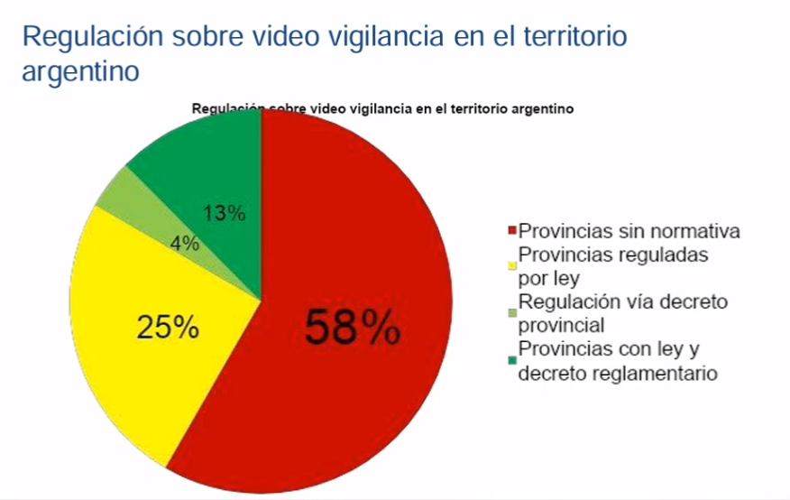
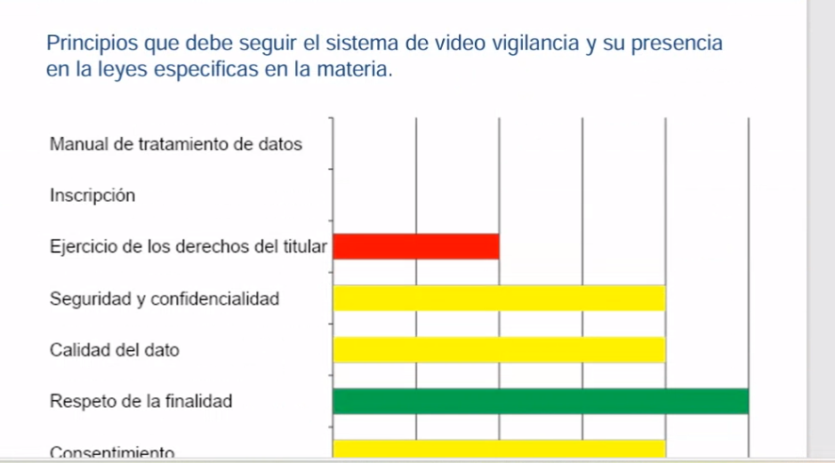
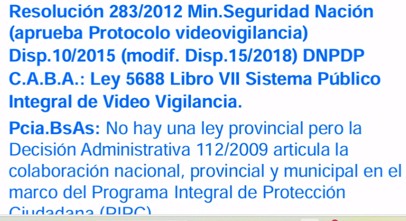
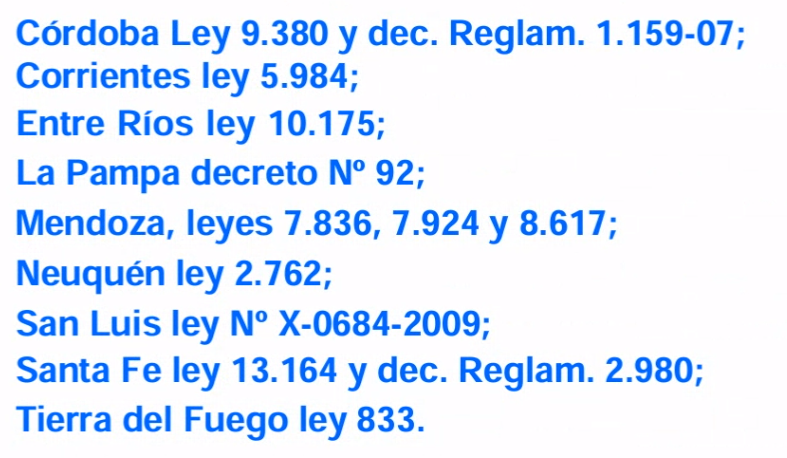
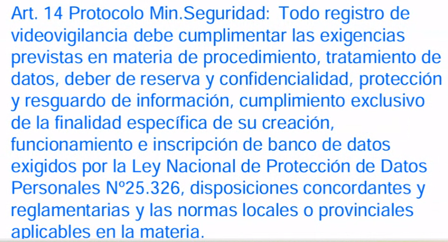

## Clase 07

Hablamos sobre videovigilancia, el alcance legal de las mismas. Caso Argentina, EEUU, Inglaterra. 

Normas relacionadas a las leyes provinciales de videovigilancia:

Tienen que cumplir con la Ley vigente. 

---

Comenta fechas TP final:

12/06 es la entrega, 19/06 defensa oral