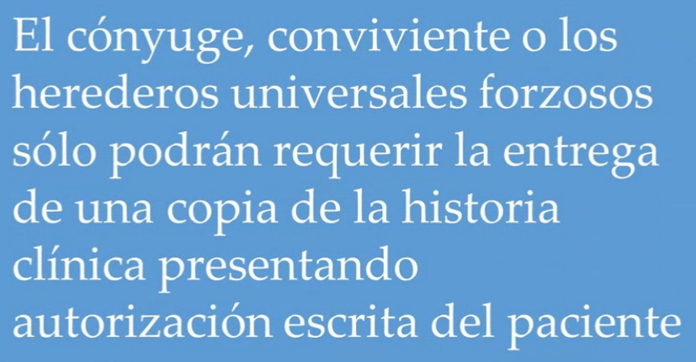
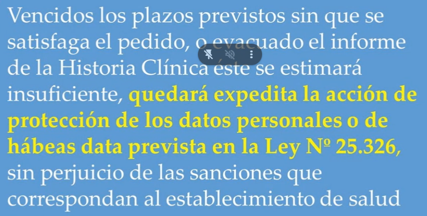
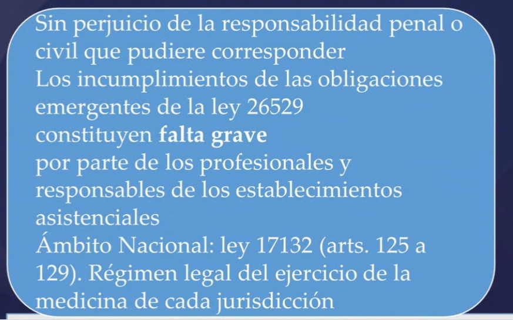

## Clase 08

Datos personales en el contexto de la salud.

- Resguardo de datos
- Casos de responsabilidad
- Acceso a historia clínica

Ejemplo de acceso de parientes:

Se puede denegar el acceso a estos datos:

Debe haber un resguardo del expediente médigo (ya sea físico o digital).

Sanciones administrativas:

---

Revisamos dudas del TP