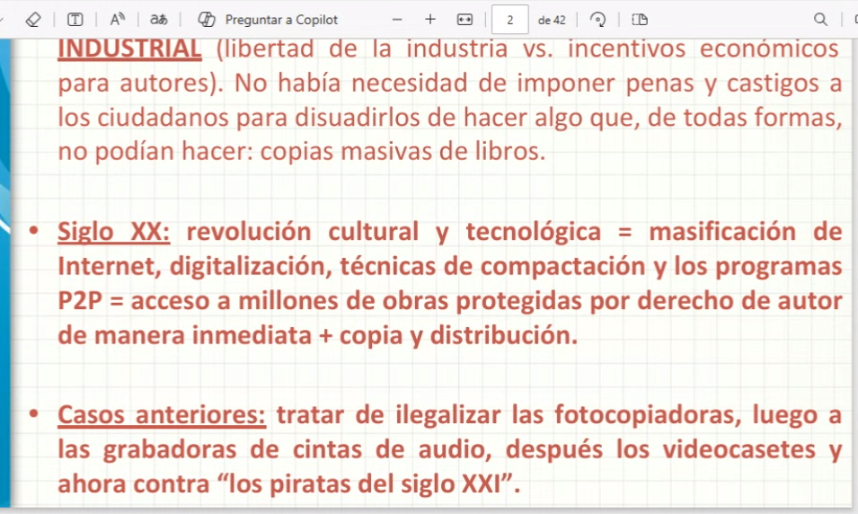
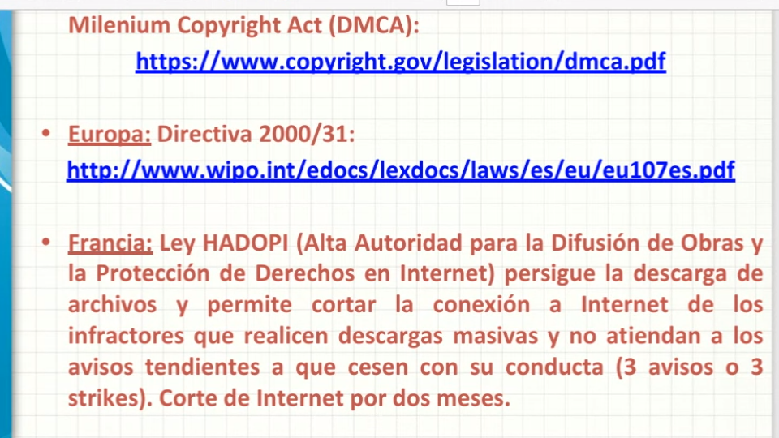
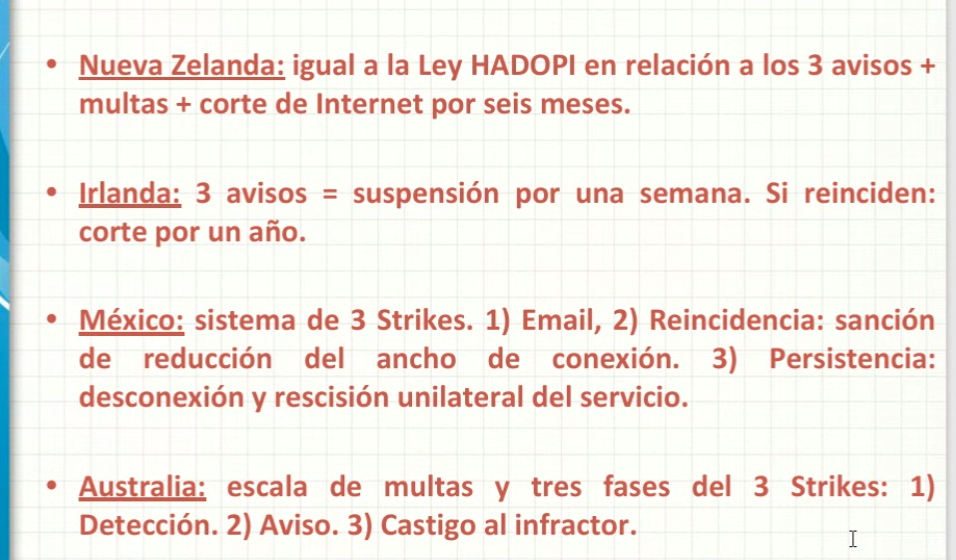
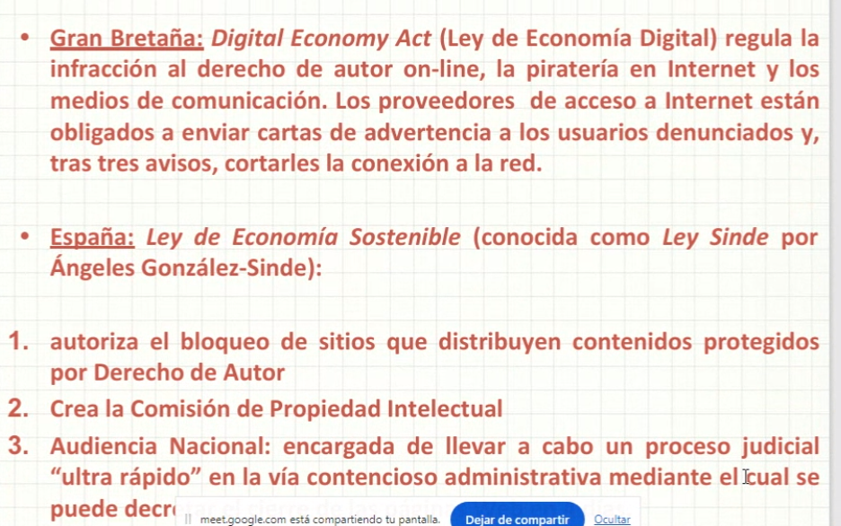

## Clase 10

Propiedad intelectual

Cambio de paradigma autor / consumidor

Concepto de piratería (basado en artículo de la UN)

Hablamos sobre el impacto de la piratería en la cultura. A nivel social cómo nos afecta. El rol de la industria discográfica, cinematográfica, etc.

Contexto nacional e internacional.

Menciona casos Napster, Kazza, Megaupload. También los casos de Argentina como Taringa.