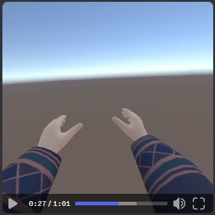
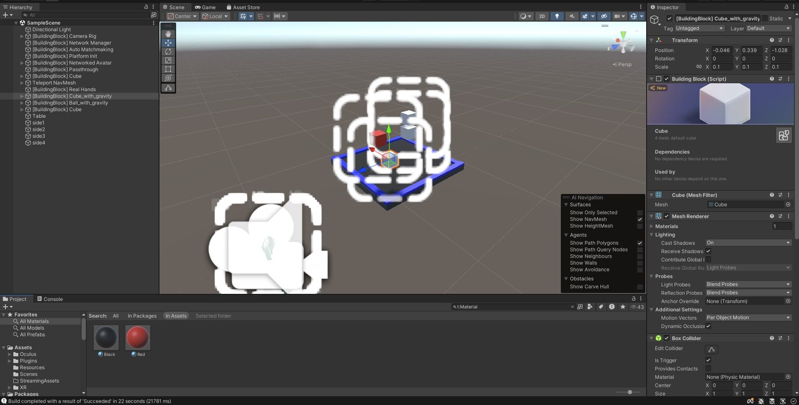
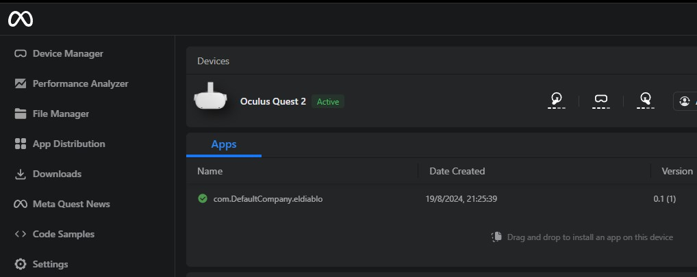

## Clase 02

El profe no pudo asistir por motivos de fuerza mayor.

Por ahora sigo avanzando con el TP. La idea sigue siendo hacer una app para Oculus Meta Quest 2.

Ya dejé armado lo siguiente:

- Setup Unity
    - Instalación Unity Hub
    - Creación de proyecto
    - Setup para Android / XR
    - Build setup (quedó ok para oculus)
    - Primeros pasos con escena + Meta Building Blocks (https://developer.oculus.com/documentation/unity/bb-overview/)
    - Quedó creada la escena con los siguientes bloques:
        - Camera Rig
        - Network Manager
        - Auto Matchmaking
        - Networked Avatar
        - Passthrough
        - Real Hands
        - Controller Tracking
    - Agregué una tabla como mesa y unos objetos (cubos) que se pueden mover con y sin gravedad

- Setup Meta Quest Developer Hub
    - Quedó seteado el dispositivo
    - Se pueden instalar builds via cable
    - Las primeras pruebas anduvieron ok

Screens:

TBD: testear la conexión remota con otro dispositivo