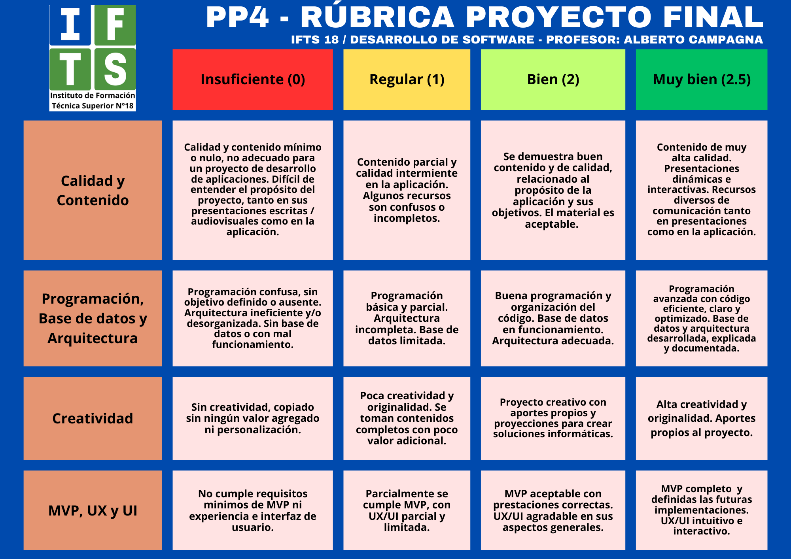

## Clase 03

Empezamos repasando el classroom y drive. Nos muestra los distintos workshops de la materia.

Comenta de nuevo el tema de promoción y regularidad:

Pasa a repasar todos los requerimientos del TP final. Un poco la misma movida que la primera clase, bastante libertad en la elección del tema, el scope, el stack y todo. Lo que sí tengo que revisar es el tema BD, un requisito es que el proyecto tenga BD y yo no había considerado eso. Lo que estoy pensando es hacer un registro de usuarios (opcional, o sea que por defecto puedas entrar sin login) y que eso sea lo que se guarda en la BD que en principio me imagino hacerla con supabase.

Nos menciona que se sugiere hacer una presentación donde comentamos el proyecto.

Anotamos los grupos en drive.

La próxima clase tenemos que hacer una primera presentación de la idea.