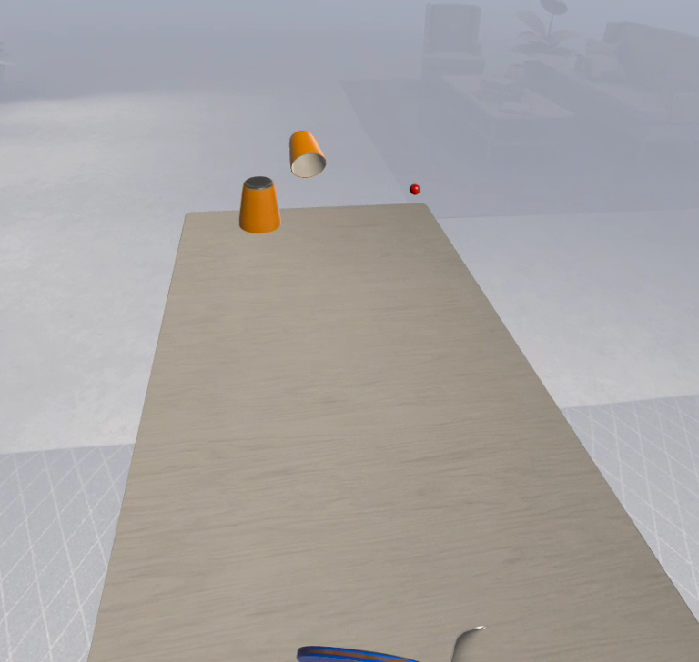
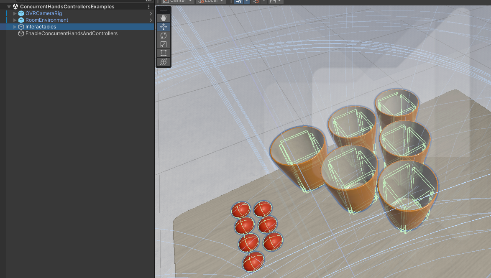

## Avances TP final

Voy bajando avances del proyecto acá. Por ahora tengo la escena a la que le puse unas paredes, una mesa y unos objetos.

[23-08-24]

Algunas funcionalidades que están implementadas:

- CameraRig (ok)
- HandsInteraction (ok)
- ControllerInteraction (ok)
- NetworkedAvatar (falta testear)
- MatchMaking (falta testear)

Los objetos como los cubos se mueven bien con los controles y con los gestos de las manos.

Se comenzó con la parte de movimiento con el script `SmoothLocomotion.cs` y si bien es posible moverse por la escena, todavía falta bastante para que quede bien fluido.

Dejé un repo creado y un .apk como release compartido ahí mismo para poder testearlo en los dispositivos de otros amigos: https://github.com/kaenovsky/xr-rancho/releases/tag/v0.0.9

[31-08-24]

Empecé a probar el SDK de Interacciones de Meta: https://assetstore.unity.com/packages/tools/integration/meta-xr-interaction-sdk-265014

Las funcionalidades de interacción con la paleta de ping pong y las pelotitas anda bien.

[08-09-24]

Cambié un poco la idea del juego para que haga más foco en lo social, charlar con otra persona y que el juego sea algo secundario. En vez de ping pong que requiere más atención a los movimientos, estoy haciendo que el juego sea tipo beer-pong, lo que da una excusa perfecta para hacer hincapié en la parte social.

Algunas de las funcionalidades implementadas y ajustadas:

- Colliders compuestos en los vasos (ok)
- Pelotas y vasos duplicados en ambos lados de la mesa (ok)
- Ajustes en la jugabilidad: estabilidad mejorada en los vasos
- Se logró que las pelotas caigan correctamente en los vasos tras ajustar los colisionadores internos y la masa de los objetos. El comportamiento general del juego es bastante fluido, aunque todavía hay áreas que se pueden optimizar.

Próximos pasos:

- Implementar Photon Fusion para agregar funcionalidad multijugador.
- Integrar chat de voz usando Building Blocks.