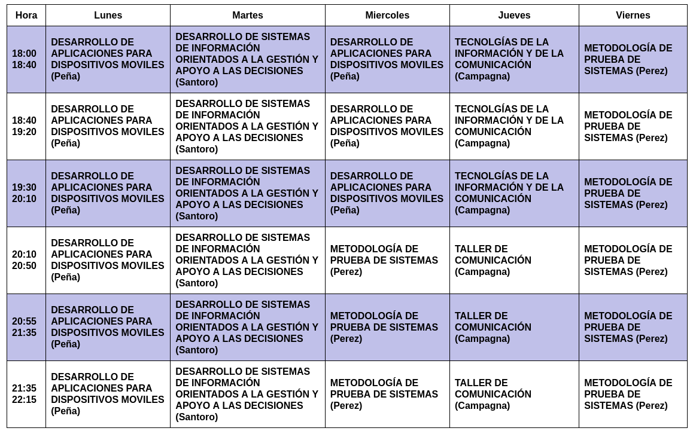
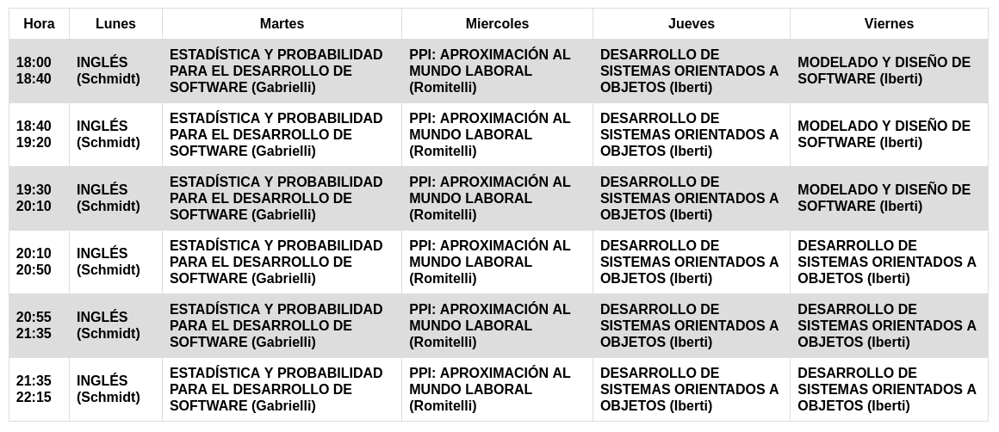
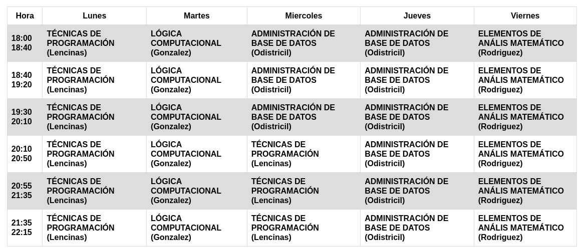

## Información IFTS

Web principal del IFTS N° 18: https://www.ifts18.edu.ar/

#### Horarios de cursada

[Ver todos los horarios en la web](https://www.ifts18.edu.ar/carreras/desarrollo-de-software/horario-tsds)

Tercer cuatrimestre:

Segundo cuatrimestre:

Primer cuatrimestre:

---

#### Información Institucional

[Plan de estudio completo](https://www.ifts18.edu.ar/carreras/desarrollo-de-software/plan-tsds)

[Equivalencias con Análisis de Sistemas](https://www.ifts18.edu.ar/carreras/equivalencias-entre-planes)

---

#### Contacto con IFTS

Mansilla 3643 (C1170ACO) Ciudad Autónoma de Buenos Aires, Argentina

Teléfono: 4823-2477

Horario de clases: Lunes a Viernes de 18:30 a 22:00 hs.

Horario de atención al público: Lunes a Viernes de 19:00 a 21:00 hs.

Mail: [dfts_ifts18_de2@bue.edu.ar](mailto:Dfts_ifts18_de2@bue.edu.ar)