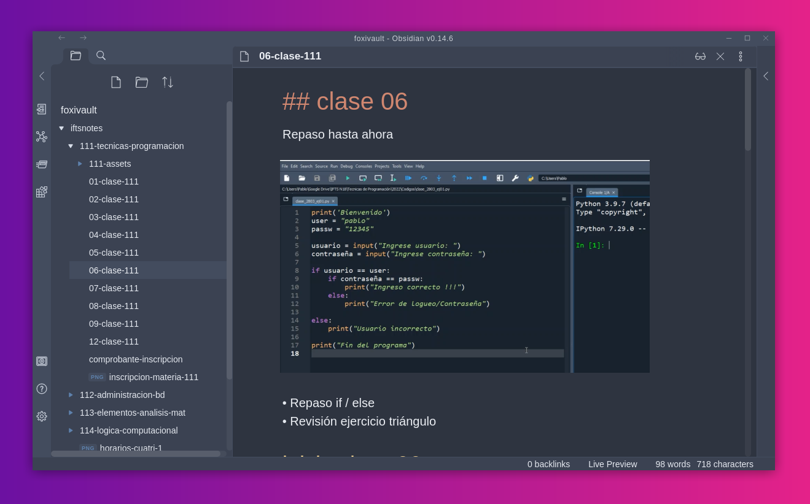

# IFTS notes
Apuntes de la carrera [Tec. en Desarrollo de Software (IFTS18)](https://www.ifts18.edu.ar/carreras/desarrollo-de-software). La estructura de los directorios y el markdown de los documentos están pensados para leer estas notas en [Obsidian](https://obsidian.md/).

## Materias aprobadas

Voy a ir agregando materias aprobadas a la tabla a continuación y en el archivo `./grades/grades.json` ~~con la idea de implementar un widget en algún momento~~ (update: por ahora dejo subida una primera versión [acá](https://iftsnotes.vercel.app/) mostrando el avance de la carrera).

Las materias están referenciadas por el número que está descripto en el [plan de estudios](https://www.ifts18.edu.ar/carreras/desarrollo-de-software/plan-tsds). Por ejemplo: 111 corresponde a la materia Técnicas de Programación (código 1.1.1).

Tabla de materias aprobadas ~ Jul 2024

| Materia | cuatrimestre | nota final |
|-----|---|----| 
| 111 | 1 | 10 | 
| 112 | 1 |  9 |
| 113 | 1 |  7 | 
| 114 | 1 |  8 | 
| 121 | 2 |  9 | 
| 122 | 2 | 10 | 
| 123 | 2 |  8 | 
| 124 | 2 |  9 | 
| 125 | 2 |  9 | 
| 211 | 3 |  9 | 
| 212 | 3 |  8 | 
| 213 | 3 | 10 | 
| 214 | 3 | 10 | 
| 215 | 3 | 10 | 
| 221 | 4 |  9 | 
| 222 | 4 |  8 | 
| 223 | 4 | 10 | 
| 224 | 4 |  9 |
| 312 | 5 | 10 |
| 314 | 5 | 10 |
