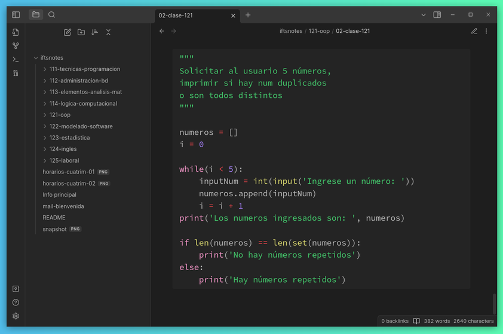

# IFTS notes
Apuntes de la carrera [Tec. en Desarrollo de Software (IFTS18)](https://www.ifts18.edu.ar/carreras/desarrollo-de-software). La estructura de los directorios y el markdown de los documentos están pensados para leer estas notas en [Obsidian](https://obsidian.md/).

## Materias aprobadas

Voy a ir agregando materias aprobadas a la tabla a continuación y en el archivo `./grades.json` con la idea de implementar un widget en algún momento. Las materias están referenciadas por el número que está descripto en el [plan de estudios](https://www.ifts18.edu.ar/carreras/desarrollo-de-software/plan-tsds). Por ejemplo: 111 corresponde a la materia Técnicas de Programación (código 1.1.1).

Tabla de materias ~ Jul 2023

| Materia | cuatrimestre | nota final |
|-----|---|----| 
| 111 | 1 | 10 | 
| 112 | 1 |  9 | 
| 114 | 1 |  8 | 
| 121 | 2 |  9 | 
| 122 | 2 | 10 | 
| 123 | 2 |  8 | 
| 124 | 2 |  9 | 
| 125 | 2 |  9 | 
| 211 | 3 |  9 | 
| 122 | 3 |  8 | 
| 123 | 3 | 10 | 
| 124 | 3 | 10 | 
| 125 | 3 | 10 | 